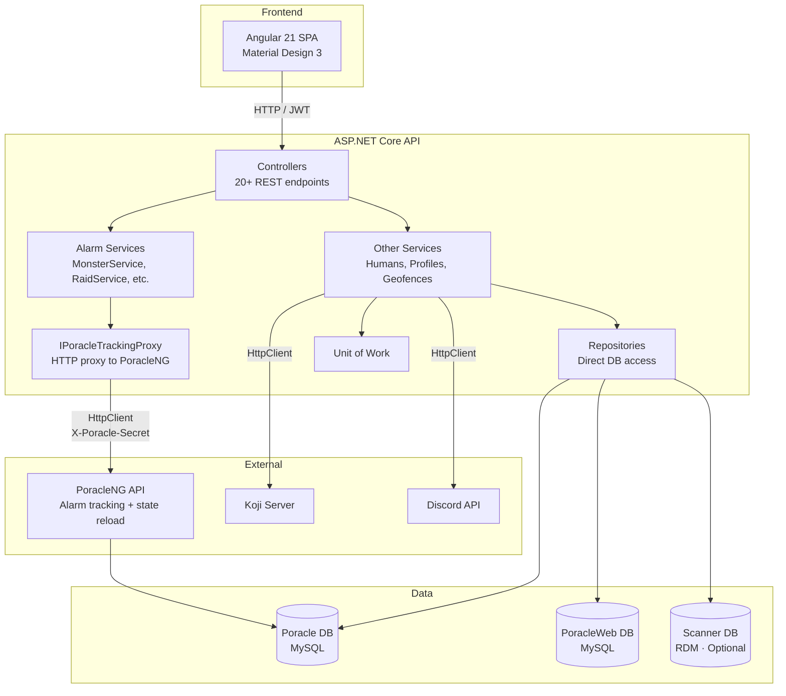

# Architecture Overview

PoracleWeb is a full-stack application with a .NET 10 backend API and Angular 21 frontend SPA.

## Solution structure

```
Pgan.PoracleWebNet.slnx
├── Applications/
│   ├── Web.Api/                    ASP.NET Core host
│   │   ├── Controllers/            REST API controllers (all under /api/)
│   │   ├── Configuration/          DI registration, settings classes
│   │   └── Services/               Background services (avatar cache, DTS cache)
│   └── Web.App/ClientApp/          Angular 21 SPA
│       └── src/app/
│           ├── core/               Guards, services, interceptors, models
│           ├── modules/            Feature pages (dashboard, pokemon, raids, etc.)
│           └── shared/             Reusable components, utilities
├── Core/
│   ├── Core.Abstractions/          Interfaces (IRepository, IService, IUnitOfWork)
│   ├── Core.Models/                DTOs passed between layers
│   ├── Core.Mappings/              AutoMapper profiles
│   ├── Core.Repositories/          Data access implementations
│   ├── Core.Services/              Business logic
│   └── Core.UnitsOfWork/           Unit of work pattern
├── Data/
│   ├── Data/                       EF Core DbContexts, Entities, Configurations
│   └── Data.Scanner/               Optional scanner DB context (RDM)
└── Tests/
    └── Pgan.PoracleWebNet.Tests/     xUnit backend tests
```

## Layer diagram



!!! info "Alarm writes go through PoracleNG"
    All alarm tracking CRUD (Pokemon, Raids, Eggs, Quests, Invasions, Lures, Nests, Gyms) is proxied through the PoracleNG REST API via `IPoracleTrackingProxy`. This ensures PoracleNG applies field defaults, deduplication, and triggers immediate state reload. Direct database access is only used for user management (`humans`, `profiles`) and application-owned data (`poracle_web` database). See [PoracleNG API Proxy](poracleng-proxy.md) for details.

## Key design decisions

### Alarm writes proxied through PoracleNG
All alarm tracking writes (create, update, delete) go through the PoracleNG REST API, not directly to the database. PoracleNG applies field defaults (`cleanRow()`), detects duplicates, and triggers immediate state reload. This eliminates data integrity bugs caused by missing defaults or stale state. See [PoracleNG API Proxy](poracleng-proxy.md).

### Separate databases
PoracleWeb does **not** modify the Poracle DB schema. The Poracle database is managed by PoracleNG. Application-owned data (user geofences, site settings, webhook delegates, quick pick definitions) lives in a separate `poracle_web` database managed by EF Core migrations.

### Unified geofence feed
PoracleWeb acts as the single geofence source for PoracleJS. It fetches admin geofences from Koji, merges them with user-drawn geofences, and serves everything via one endpoint (`GET /api/geofence-feed`). No custom code needed in PoracleJS or Koji.

### AutoMapper for partial updates
All update models use nullable `int?` properties so partial updates don't zero out unset fields. The mapping profile skips null properties automatically. Note: AutoMapper is now only used for non-alarm entities (humans, profiles). Alarm data flows as raw JSON through the PoracleNG API proxy.

### Gym picker
The `GymPickerComponent` (shared) lets users search for specific gyms when creating team, raid, or egg alarms. It calls the `ScannerService` (frontend) which hits scanner gym search endpoints on the backend (`ScannerController`). Search results use the `GymSearchResult` model and include photo thumbnails and area names resolved via the `PointInPolygon` geo utility. The scanner DB is optional — when not configured, the gym picker is hidden.

### Per-IP rate limiting
Auth endpoints use per-IP partitioned rate limiting (not global). This prevents one user's activity from locking out others.
