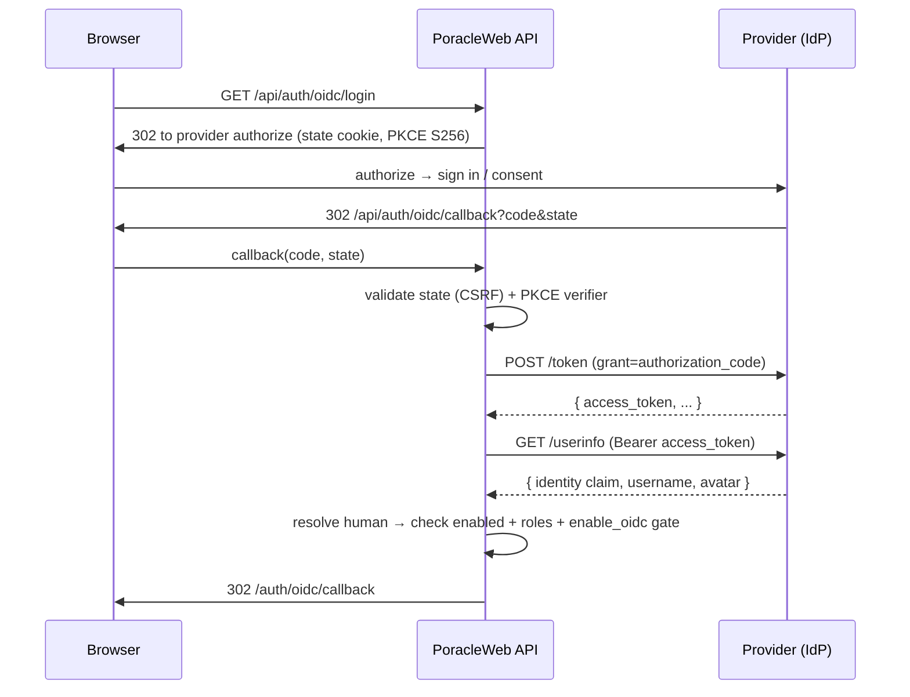

# External SSO / OpenID Connect Login

PoracleWeb.NET can delegate **login** to a generic external OAuth2 / OpenID Connect
provider, so users sign in with your own identity provider instead of (or alongside)
Discord and Telegram. This page is the comprehensive, provider-agnostic guide to
configuring that login flow.

!!! info "Provider-agnostic — PogoAlerts is just the reference"
    The SSO flow is a configurable twin of the [Discord OAuth flow](../getting-started/discord-oauth.md),
    parameterized entirely by `OIDC_*` config. **PogoAlerts** (PGAN's identity provider) is one
    instance, but nothing in the flow is special to it — it rests only on spec-standard
    OAuth2/OIDC (`/authorize`, `/token`, `/userinfo`, plus optional `/end-session`). It works with
    **any** compliant provider: Keycloak, Authentik, Auth0, Google, Azure AD / Entra, Okta, and more.

You can **ignore OIDC entirely** — it is off by default and the sign-in page stays in **Local**
mode (Discord / Telegram). Turn it on only when you want to point PoracleWeb at a provider.

!!! warning "The one inherent constraint"
    The identity claim returned by your provider's userinfo endpoint **must resolve to an existing
    Poracle `human` id** — i.e. a Discord or Telegram id that already exists in your Poracle
    database. PoracleWeb does not provision new users from SSO; it authenticates *existing* Poracle
    users through your provider. If the claim doesn't match a registered `human`, login fails with
    [`user_not_registered`](#error-codes). Set `OIDC_IDENTITY_CLAIM` to the userinfo claim that
    carries that id (it falls back to the standard `sub` claim when the configured claim is absent).

Silent session renewal and refresh-token handling are documented separately on the
**[OIDC Refresh Tokens](oidc-refresh-tokens.md)** page — this page covers the login itself.

---

## How it works

The flow is the standard OAuth2 authorization-code grant (with PKCE by default):



- **CSRF**: a random `state` value is stored in an `HttpOnly` cookie and verified on callback.
- **PKCE**: when `OIDC_USE_PKCE=true` (default), a code verifier is stored in an `HttpOnly`
  cookie and only the S256 challenge is sent to the provider.
- **Redirect URI**: PoracleWeb always uses `{your-host}/api/auth/oidc/callback`. Register exactly
  this URI at your provider.
- **Identity resolution**: the configured identity claim (falling back to `sub`) is looked up
  against the Poracle `human` table. The provider authenticates; Poracle authorizes.
- **JWT type claim**: successful logins mint PoracleWeb's internal JWT with the `type` claim set
  to `OIDC_IDENTITY_TYPE` (default `discord:user`), so admin/role resolution treats the passed-through
  Discord id consistently with a direct Discord login.

---

## Step-by-step setup

1. **Register a client at your identity provider.** Create an OAuth2 / OIDC application and set its
   redirect (callback) URI to:

   ```
   {your-host}/api/auth/oidc/callback
   ```

   for example `https://poracle.example.com/api/auth/oidc/callback`. Note the client id and client
   secret. Enable PKCE if your provider supports it (recommended).

2. **Configure the `OIDC_*` variables** in your `.env` (see the [reference table](#login-configuration-reference)).
   At minimum you need the three endpoint URLs, the client id, the client secret, and — unless your
   provider's `sub` claim already holds the Poracle id — `OIDC_IDENTITY_CLAIM`. Restart PoracleWeb
   so the server config takes effect.

3. **Switch the sign-in mode to SSO.** In **Admin → Settings → Authentication**, flip the
   **Local ⇄ SSO** segmented switch to **SSO**. This is the runtime opt-in (`enable_oidc=true`) and
   is gated on OIDC being fully configured plus a confirmation dialog. See
   [Auth mode](#auth-mode-local-vs-sso) below.

!!! tip "Verify before flipping the switch"
    `OIDC_ENABLED` is **auto-inferred true** when `OIDC_CLIENT_ID` and the three URLs
    (`OIDC_AUTHORIZATION_URL`, `OIDC_TOKEN_URL`, `OIDC_USERINFO_URL`) are all set — you don't have to
    set it explicitly. The admin **Authentication** panel shows a read-only OIDC config card (from
    `/api/settings/oidc-config`, with secrets masked) so you can confirm the server picked up your
    config before switching everyone to SSO.

---

## Login configuration reference

All variables are read from `.env` (or the `Oidc__*` .NET convention) and require a restart to take
effect. The provider secret is **never stored in the database** and is only ever returned masked.

| `.env` name | `.NET` env variable | Default | Description |
|---|---|---|---|
| `OIDC_ENABLED` | `Oidc__Enabled` | *(auto-inferred `true` when `OIDC_CLIENT_ID` + the three URLs are set)* | Master switch from server config. When false the provider is hidden regardless of other values. |
| `OIDC_PROVIDER_NAME` | `Oidc__ProviderName` | `""` | Display name shown on the login button, e.g. `PogoAlerts`. |
| `OIDC_AUTHORIZATION_URL` | `Oidc__AuthorizationUrl` | `""` | Browser-facing authorize endpoint. Any existing query string is **preserved** (e.g. a `?hide=…` filter, or Google's `?access_type=offline`). |
| `OIDC_TOKEN_URL` | `Oidc__TokenUrl` | `""` | Token endpoint that exchanges the authorization code for tokens. |
| `OIDC_USERINFO_URL` | `Oidc__UserInfoUrl` | `""` | Userinfo endpoint returning the user's claims. |
| `OIDC_END_SESSION_URL` | `Oidc__EndSessionUrl` | `""` | **Optional.** RP-initiated end-session endpoint. When set, enables OIDC single logout (SLO) — see [Single logout](#single-logout-slo). |
| `OIDC_CLIENT_ID` | `Oidc__ClientId` | `""` | OAuth2 client id. |
| `OIDC_CLIENT_SECRET` | `Oidc__ClientSecret` | `""` | OAuth2 client secret. **Never stored in the database**; returned masked by the admin config endpoint. |
| `OIDC_SCOPES` | `Oidc__Scopes` | `openid profile email` | Space-delimited OAuth scopes requested at authorization time. |
| `OIDC_IDENTITY_CLAIM` | `Oidc__IdentityClaim` | `discord_id` | Userinfo claim whose value is the user's Poracle `human` id (a Discord/Telegram id). Falls back to `sub` when the configured claim is absent. **Must resolve to an existing `human`** — see [the inherent constraint](#external-sso-openid-connect-login). |
| `OIDC_USERNAME_CLAIM` | `Oidc__UsernameClaim` | `preferred_username` | Userinfo claim used as the display username. |
| `OIDC_AVATAR_CLAIM` | `Oidc__AvatarClaim` | `picture` | Userinfo claim used as the avatar URL. |
| `OIDC_IDENTITY_TYPE` | `Oidc__IdentityType` | `discord:user` | Value written to the JWT `type` claim for SSO logins. |
| `OIDC_USE_PKCE` | `Oidc__UsePkce` | `true` | Use PKCE (S256) for the authorization-code exchange. Recommended. |
| `AUTH_FORCE_LOCAL` | `Auth__ForceLocal` | `false` | **Break-glass.** Forces the local login page regardless of SSO mode — see [Break-glass](#break-glass-auth_force_local). |

The refresh-token variables (`OIDC_USE_REFRESH_TOKENS`, `OIDC_ACCESS_TOKEN_MINUTES`,
`OIDC_OFFLINE_ACCESS_SCOPE`, `OIDC_TOKEN_AUTH_METHOD`, …) are documented on the
[OIDC Refresh Tokens](oidc-refresh-tokens.md) page. See also the full
[Configuration Reference](reference.md).

---

## Auth mode (Local vs SSO)

The admin **Authentication** panel exposes a single segmented **Local ⇄ SSO** switch backed by the
one runtime [site setting](site-settings.md) `enable_oidc`:

| `enable_oidc` | Sign-in mode |
|---|---|
| absent / `false` | **Local** — Discord / Telegram (the default; SSO is **opt-in**). |
| `true` | **SSO** — the login page auto-redirects to your OIDC provider. |

- **OIDC is opt-in.** Unlike Discord/Telegram (where an absent setting means *enabled*), SSO is only
  active when `enable_oidc` is explicitly `true`. The default sign-in mode is always Local.
- Switching to **SSO** is gated on OIDC being fully configured **and** a confirmation dialog, to
  prevent locking yourself out against a misconfigured provider.
- In **SSO** mode the Discord and Telegram sections of the Authentication panel are hidden, replaced
  by the read-only OIDC config card (from `/api/settings/oidc-config`, secrets masked), the
  [single-logout toggle](#single-logout-slo) (when an end-session URL is set), and the silent-refresh
  toggle (when refresh is configured — see the [refresh page](oidc-refresh-tokens.md)).

!!! note "Admins can always reach the login page"
    Even when `enable_oidc=false`, the `enable_oidc` gate is **not** an early block — it is enforced
    only after the user is identified, and **admins bypass it**. This means an admin can always sign
    in (via any configured method) to re-enable the setting, exactly like the Discord/Telegram gates.

---

## Login page behavior

- When SSO is active, the login page **auto-redirects** to your provider so users aren't shown an
  unnecessary intermediate screen.
- `/login?loggedout=1` shows a **"Signed out"** panel and **suppresses** the auto-redirect, so a user
  who just logged out isn't immediately re-logged-in. The single-logout flow redirects here.
- The `/api/auth/providers` endpoint drives the login UI. Its `oidc` block reports:
  `configured`, `enabledByAdmin`, `providerName`, `endSession` (whether SLO is available), and
  `refresh` (whether silent refresh is wired up).

---

## Single logout (SLO)

When `OIDC_END_SESSION_URL` is set, signing out can also end the user's session **at the provider**
(RP-initiated logout), not just locally. `GET /api/auth/oidc/logout` bounces the browser to the
provider's end-session endpoint with a `post_logout_redirect_uri` of `{origin}/login?loggedout=1`,
then returns to the signed-out panel.

Single logout requires **both**:

1. `OIDC_END_SESSION_URL` configured, **and**
2. the runtime toggle `enable_oidc_slo` not set to `false` (absent = **on** once the URL is wired).

If either is missing, logout falls back to **local-only** — PoracleWeb clears its own session but the
provider session survives.

---

## Break-glass (`AUTH_FORCE_LOCAL`)

`AUTH_FORCE_LOCAL=true` (`Auth__ForceLocal`) forces the local login page **regardless** of the SSO
mode. It is a recovery mechanism: if an admin switches to SSO against a provider that is down or
misconfigured and everyone is locked out, set this env flag and restart to get the local Discord /
Telegram login back without touching the database.

It overrides `enable_oidc` for the `/api/auth/providers` response (OIDC reports `enabledByAdmin=false`
while it is set). The admin OIDC config card surfaces a `forceLocal` flag so the UI can explain why
OIDC appears inactive even when enabled.

---

## Error codes

On any failure the browser is redirected to `/login#error=CODE`. The login page maps these to a
message.

| `CODE` | Meaning |
|---|---|
| `oidc_disabled` | OIDC is not configured at all, **or** a non-admin user attempted SSO while `enable_oidc=false`. |
| `oidc_token_exchange_failed` | The `/token` code exchange failed (bad client secret, wrong redirect URI, expired code, auth-method mismatch). |
| `oidc_userinfo_failed` | The `/userinfo` call failed or returned no usable body. |
| `oidc_no_identity` | Neither the configured `OIDC_IDENTITY_CLAIM` nor the fallback `sub` claim was present in userinfo. |
| `user_not_registered` | The identity claim resolved, but no matching Poracle `human` exists. Register the user in Poracle first (the [inherent constraint](#external-sso-openid-connect-login)). |
| `not_in_guild` | Role gating reused from the Discord path: the (Discord) user isn't in the configured guild. |
| `missing_required_role` | Role gating: the user lacks one or more required roles. |
| `role_check_failed` | Role gating: the role check itself errored (e.g. bot token / guild misconfigured). |

The `not_in_guild` / `missing_required_role` / `role_check_failed` codes only apply when role-based
access (`enable_roles`) is configured and the identity is a Discord id — they are shared verbatim with
the [Discord login path](../getting-started/discord-oauth.md).

---

## Endpoints

| Method & path | Purpose |
|---|---|
| `GET /api/auth/oidc/login` | Begins the flow; 302s to the provider's authorize endpoint. 404s when OIDC isn't configured. |
| `GET /api/auth/oidc/callback` | Handles the provider redirect: validates state + PKCE, exchanges the code, fetches userinfo, mints the JWT. |
| `GET /api/auth/oidc/logout` | RP-initiated end-session (single logout) when configured + enabled; otherwise redirects to the signed-out panel. |
| `GET /api/auth/providers` | Returns provider availability for the login page, including the `oidc` block (`configured`, `enabledByAdmin`, `providerName`, `endSession`, `refresh`). |
| `GET /api/settings/oidc-config` | **Admin-only.** Read-only server-side OIDC config for the admin panel; secrets masked. |

`POST /api/auth/oidc/refresh` and `/refresh/revoke` belong to the silent-renewal feature — see the
[OIDC Refresh Tokens](oidc-refresh-tokens.md) page.

---

## Provider matrix

For **login**, the per-provider differences come down to the **identity claim**. (If you also enable
[refresh tokens](oidc-refresh-tokens.md), the token-endpoint auth method and offline-access scope also
matter — those columns are included for convenience.)

| Provider | `OIDC_IDENTITY_CLAIM` | `OIDC_TOKEN_AUTH_METHOD` † | `OIDC_OFFLINE_ACCESS_SCOPE` † |
|---|---|---|---|
| PogoAlerts | `discord_id` | `client_secret_post` | `offline_access` |
| Keycloak | `sub` | `client_secret_basic` | `offline_access` |
| Authentik | `sub` | `client_secret_post` | `offline_access` |
| Auth0 | `sub` | `client_secret_post` | `offline_access` |
| Google | `sub` | `client_secret_post` | *(empty — append `?access_type=offline` to the authorize URL)* |
| Azure AD / Entra | `sub` or `oid` | `client_secret_post` | `offline_access` |
| Okta | `sub` | `client_secret_basic` | `offline_access` |

† Only relevant if you also enable refresh tokens. For plain login, these are ignored.

Copy-paste login snippets for the most common providers (replace the example URLs with your
provider's actual endpoints):

### Keycloak

```bash
OIDC_PROVIDER_NAME=Keycloak
OIDC_AUTHORIZATION_URL=https://kc.example.com/realms/poracle/protocol/openid-connect/auth
OIDC_TOKEN_URL=https://kc.example.com/realms/poracle/protocol/openid-connect/token
OIDC_USERINFO_URL=https://kc.example.com/realms/poracle/protocol/openid-connect/userinfo
OIDC_END_SESSION_URL=https://kc.example.com/realms/poracle/protocol/openid-connect/logout
OIDC_CLIENT_ID=poracleweb
OIDC_CLIENT_SECRET=your_client_secret
OIDC_SCOPES=openid profile email
OIDC_IDENTITY_CLAIM=sub
OIDC_USE_PKCE=true
```

!!! note "Mapping `sub` to a Poracle id"
    For providers like Keycloak that key on `sub`, the user's `sub` must equal their Poracle `human`
    id (their Discord/Telegram id). Configure your provider to expose the Discord/Telegram id as the
    subject — or as a custom claim and point `OIDC_IDENTITY_CLAIM` at it — otherwise login resolves to
    a non-existent user and fails with `user_not_registered`.

### Auth0

```bash
OIDC_PROVIDER_NAME=Auth0
OIDC_AUTHORIZATION_URL=https://your-tenant.us.auth0.com/authorize
OIDC_TOKEN_URL=https://your-tenant.us.auth0.com/oauth/token
OIDC_USERINFO_URL=https://your-tenant.us.auth0.com/userinfo
OIDC_END_SESSION_URL=https://your-tenant.us.auth0.com/oidc/logout
OIDC_CLIENT_ID=your_client_id
OIDC_CLIENT_SECRET=your_client_secret
OIDC_SCOPES=openid profile email
OIDC_IDENTITY_CLAIM=sub
OIDC_USE_PKCE=true
```

For Google, Azure AD / Entra, and Okta, use the same shape — set the three endpoint URLs and the
identity claim from the matrix above. Google needs `?access_type=offline` appended to
`OIDC_AUTHORIZATION_URL` only if you go on to enable refresh tokens.

---

## Next: silent session renewal

By default PoracleWeb mints a short-lived internal JWT and discards the provider's tokens at login.
To keep sessions alive in the background and propagate provider-side disable/logout to PoracleWeb,
enable refresh-token consumption:

➡️ **[OIDC Refresh Tokens](oidc-refresh-tokens.md)** — opt-in silent renewal, revocation propagation,
the provider config matrix for refresh, and the security model.

## Related pages

- [Configuration Reference](reference.md) — the full `OIDC_*` variable list and every other env var.
- [Site Settings](site-settings.md) — the `enable_oidc` and `enable_oidc_slo` runtime toggles.
- [Discord OAuth](../getting-started/discord-oauth.md) — the login flow SSO mirrors, and the source of
  the reused role-gating error codes.
