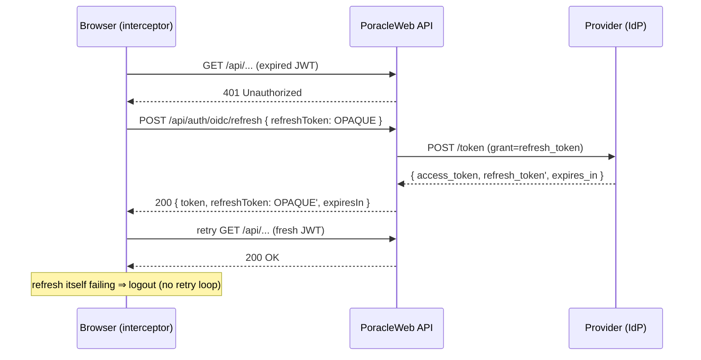
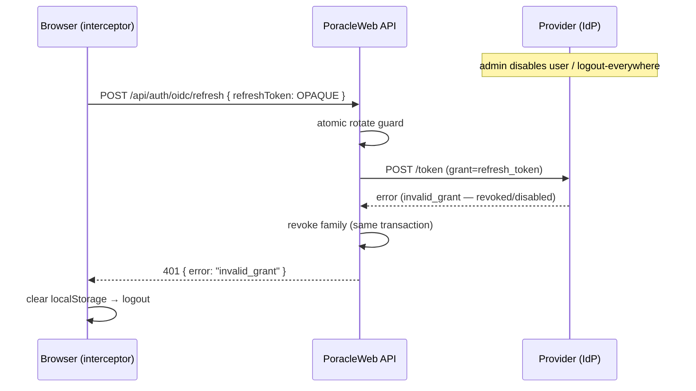
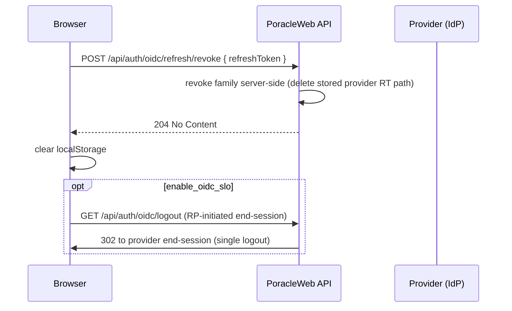

# OIDC Refresh Tokens

PoracleWeb.NET can log users in through External SSO / OIDC — a generic external OIDC / OAuth2
provider. Once that login is working, it mints its own short-lived internal session token (a JWT)
and, by default, **discards** the provider's access and refresh tokens.

This page documents an **opt-in** feature that makes PoracleWeb consume the provider's
**refresh token** so it can:

- keep sessions alive without a hard 24-hour re-login (silent renewal in the background),
- **propagate provider-side revocation** — when an admin disables the user (or they "log out
  everywhere") at the identity provider, PoracleWeb drops the session at the next refresh, and
- **re-validate the user on every refresh** — disabling a user takes effect within roughly one
  access-token lifetime (~30 minutes).

!!! warning "Default OFF and provider-agnostic"
    This feature is **disabled by default** (`OIDC_USE_REFRESH_TOKENS=false`). When off, behavior
    is byte-for-byte identical to today: the provider's tokens are discarded and the internal JWT
    lives its full lifetime. **PogoAlerts is only the reference provider** — the mechanism rests
    only on spec-standard OAuth2/OIDC (`/token` with `grant_type=refresh_token`, `/userinfo`, and
    `expires_in`) and works with **any** compliant provider (Keycloak, Authentik, Auth0, Google,
    Azure AD / Entra, Okta, …). See [For any OIDC provider](#for-any-oidc-provider-self-hosters)
    below.

!!! note "Prerequisite: configure External SSO / OIDC login first"
    Refresh tokens are an **optional layer on top of a working OIDC login** — they add silent
    session renewal and provider-side revocation propagation, but they do **not** set up login by
    themselves. Configure base External SSO / OIDC first (provider URLs, client id/secret, identity
    claim, PKCE, the `enable_oidc` auth-mode switch, single logout) on the
    [External SSO (OIDC)](external-sso.md) page, confirm users can sign in, **then** opt into refresh
    tokens here.

## When to enable it

Enable it when **all** of the following hold:

- You authenticate via an external OIDC provider (`OIDC_ENABLED=true` and the provider configured).
- Your provider **issues refresh tokens**. Most providers only do this when the
  `offline_access` scope is requested (handled automatically — see below). Google uses a
  non-standard `access_type=offline` instead.
- You want seamless sessions and/or want provider-side disable/logout to terminate PoracleWeb
  sessions promptly.

## When NOT to enable it

- You log in with **Discord, Telegram, or local** accounts only — those flows have no provider
  refresh token and this feature does nothing for them (they stay on the existing path).
- Your provider **cannot issue refresh tokens**. If you turn the flag on but the provider returns
  no refresh token, PoracleWeb **gracefully falls back** to the normal 24-hour JWT for that login
  and logs `LogOidcRefreshUnavailable` so you can see why. Nothing breaks — the feature simply
  no-ops.

---

## Configuration reference

All variables are optional and default-safe. Add them to your `.env` (or use the `Oidc__*`
.NET convention). They take effect only when `OIDC_USE_REFRESH_TOKENS=true`.

| `.env` name | `.NET` env variable | Default | Description |
|---|---|---|---|
| `OIDC_USE_REFRESH_TOKENS` | `Oidc__UseRefreshTokens` | `false` | **Master opt-in.** When off, the provider's tokens are discarded and the internal JWT lives its full lifetime (24h). When on, refresh-backed OIDC sessions are created (if the provider issues a refresh token). |
| `OIDC_ACCESS_TOKEN_MINUTES` | `Oidc__AccessTokenMinutes` | `30` | Internal JWT lifetime (minutes) for **refresh-backed OIDC sessions only**. Kept short so a disable/revocation at the provider propagates within ~one access-token lifetime. Other logins are unaffected. |
| `OIDC_REFRESH_TOKEN_LIFETIME_DAYS` | `Oidc__RefreshTokenLifetimeDays` | `30` | PoracleWeb-side absolute cap (days) on a refresh session/family before a real re-login is forced. Independent of the provider's own refresh-token lifetime; if the provider's token expires first, the refresh call fails and the session is revoked. |
| `OIDC_SESSION_REVOKED_RETENTION_DAYS` | `Oidc__RevokedRetentionDays` | `2` | How long a revoked/rotated `oidc_sessions` row is kept (so a replayed old token is still detected and family-revoked) before the 6-hourly cleanup deletes it. Kept short and separate from the session cap so frequent rotation doesn't accumulate weeks of dead rows. Expired rows are deleted regardless. |
| `OIDC_OFFLINE_ACCESS_SCOPE` | `Oidc__OfflineAccessScope` | `offline_access` | Scope appended to the authorize request (only when `UseRefreshTokens` is on and the scope isn't already in `OIDC_SCOPES`) so a standards-compliant provider issues a refresh token (this includes PogoAlerts). **Set empty** only for providers that issue refresh tokens unconditionally regardless of scope, or that use a non-standard mechanism (e.g. Google's `access_type=offline`). |
| `OIDC_TOKEN_AUTH_METHOD` | `Oidc__TokenEndpointAuthMethod` | `client_secret_post` | How client credentials are presented at the token endpoint: `client_secret_post` (credentials in the form body — PogoAlerts, Authentik, Auth0, Google, Azure AD) or `client_secret_basic` (HTTP Basic header — Keycloak, Okta). Applies to **both** the code exchange and the refresh grant. |

### Relationship to the existing `OIDC_*` variables

These variables extend the base External SSO / OIDC login configuration — see
[External SSO (OIDC)](external-sso.md) for the provider URLs, client id/secret, identity claim,
scopes, and PKCE. The refresh feature reuses the same token and userinfo endpoints — no new
endpoints need to be configured on the provider side beyond enabling refresh tokens. The identity
claim (`OIDC_IDENTITY_CLAIM`, falls back to `sub`) is re-read on every refresh to re-validate the
user.

### Relationship to the `enable_oidc` site settings

Three runtime [site settings](site-settings.md) gate OIDC behavior independently of the env vars:

| Site setting | Effect |
|---|---|
| `enable_oidc` | Runtime on/off for the OIDC login button. The env `OIDC_ENABLED` is the hard master switch; this toggle disables it at runtime without a restart. |
| `enable_oidc_slo` | Runtime toggle for OIDC single-logout (RP-initiated end-session). |

Refresh-token consumption has **no** runtime site setting — it is controlled solely by the
`OIDC_USE_REFRESH_TOKENS` env flag. Refresh is coupled to the per-login JWT lifetime, so it's a
deploy-time decision (disabling it at runtime would strand the short-lived tokens of users who are
already signed in; single logout, by contrast, only affects the next logout, so it stays a runtime
toggle).

The `/api/auth/providers` response exposes a read-only `oidc.refresh` boolean (`= OIDC is
configured AND OIDC_USE_REFRESH_TOKENS is on`) so the frontend knows whether silent refresh is
active.

---

## Per-login JWT lifetime

PoracleWeb's internal JWT lifetime (`Jwt__ExpirationMinutes`, default **1440** = 24h) is a
**global** setting today. This feature introduces a **per-login** lifetime so the two session
models can coexist:

| Login type | Internal JWT lifetime |
|---|---|
| OIDC **with** an issued refresh token (refresh-backed session) | `OIDC_ACCESS_TOKEN_MINUTES` (default **30 min**) |
| Discord / Telegram / local | unchanged — **1440 min (24h)** |
| OIDC **without** a refresh token (provider issued none) | unchanged — **1440 min (24h)** |

### Why short JWTs only for refresh-backed sessions

A blanket cut of the global JWT lifetime to 30 minutes would log out Discord/Telegram/local users
every 30 minutes, because their flows have no way to silently renew. Only refresh-backed OIDC
sessions can renew in the background, so **only those** get the short lifetime. The short lifetime
is what makes revocation propagation prompt: a disabled user keeps a valid PoracleWeb session for
at most one access-token lifetime (~30 min) before the next refresh re-validates them and fails.

---

## How it works

PoracleWeb never sends the provider's refresh token to the browser. The browser holds an **opaque
PoracleWeb-minted token** (in `localStorage` as `poracle_refresh_token`) that keys a server-side
`oidc_sessions` row. That row's `EncryptedRefreshToken` column holds the *real* provider refresh
token, encrypted at rest via ASP.NET Core DataProtection. One **family** (`FamilyId`) is one login
session and one rotation chain.

```
 Browser (localStorage:                 PoracleWeb API                     Provider (IdP)
   poracle_token = short JWT            /api/auth/oidc/callback            /token
   poracle_refresh_token = opaque)      /api/auth/oidc/refresh   ───────▶   grant=authorization_code
        │  proactive ~60s before exp    /api/auth/oidc/refresh/revoke      grant=refresh_token
        │  or reactive 401              /api/auth/oidc/logout              /userinfo
        ▼                                      │
   oidcRefreshInterceptor ──────────────▶  OidcRefreshService ──┐
                                               │                 │   ┌──────────────────────────┐
                                               ▼                 └──▶│ oidc_sessions (poracle_   │
                                          OidcSessionRepository      │ web): SHA-256 hash,        │
                                          (atomic rotate / revoke)   │ FamilyId chain,            │
                                                                     │ EncryptedRefreshToken      │
                                          OidcSessionCleanupService  │ (DataProtection)           │
                                          (~6h set-based DELETE)     └──────────────────────────┘
```

### Login and refresh-token issuance

```mermaid
sequenceDiagram
  participant B as Browser
  participant P as PoracleWeb API
  participant I as Provider (IdP)
  B->>P: GET /api/auth/oidc/login
  P->>B: 302 to provider authorize (PKCE, offline_access if enabled)
  B->>I: authorize → consent
  I->>B: 302 /api/auth/oidc/callback?code
  B->>P: callback(code)
  P->>I: POST /token (grant=authorization_code)
  I-->>P: { access_token, refresh_token, expires_in }
  P->>I: GET /userinfo (Bearer access_token)
  I-->>P: { identity claim, username, ... }
  P->>P: validate human exists + enabled + roles
  alt UseRefreshTokens AND refresh_token present
    P->>P: encrypt(refresh_token); INSERT oidc_sessions (new family)
    P->>P: mint JWT (OIDC_ACCESS_TOKEN_MINUTES ≈ 30m)
    P->>B: 302 /auth/oidc/callback#token=JWT&refresh_token=OPAQUE
  else flag off OR no refresh_token returned
    P->>P: mint JWT (24h) %% graceful fallback; logs if flag on but no RT
    P->>B: 302 /auth/oidc/callback#token=JWT
  end
```

### Proactive silent refresh

The browser interceptor refreshes proactively ~60 seconds before the JWT expires, so the user
never sees an interruption.

```mermaid
sequenceDiagram
  participant B as Browser (interceptor)
  participant P as PoracleWeb API
  participant I as Provider (IdP)
  Note over B: ~60s before JWT expiry
  B->>P: POST /api/auth/oidc/refresh { refreshToken: OPAQUE }
  P->>P: hash; load session (active, not expired, not past cap)
  P->>P: atomic rotate guard (ExecuteUpdateAsync)
  P->>I: POST /token (grant=refresh_token, client_secret)
  I-->>P: { access_token, refresh_token', expires_in }
  P->>I: GET /userinfo
  P->>P: re-validate human enabled + roles
  P->>P: encrypt(refresh_token'); INSERT successor row (same family)
  P->>P: mint fresh JWT (≈30m)
  P-->>B: 200 { token, refreshToken: OPAQUE', expiresIn }
```

### Reactive 401 refresh

If a request returns 401 before the proactive timer fires, the interceptor refreshes once and
retries the original request. Concurrent 401s are coalesced into a single refresh (single-flight).



### Revocation propagation

When the provider disables the user (or its refresh token is revoked/expired), the next refresh
fails and PoracleWeb revokes the family and logs the user out — provider-side revocation reaches
PoracleWeb within one access-token lifetime.



PoracleWeb also re-validates the `human` record (exists + enabled + role gating) on **every**
refresh, so disabling a user *inside Poracle* (not just at the provider) terminates the session
the same way.

### Logout and family revoke



Replay protection: presenting an already-rotated (revoked) opaque token revokes the **entire
family** in the same transaction as the 401, defeating token theft/replay.

---

## For any OIDC provider (self-hosters)

The entire mechanism rests only on spec-standard OAuth2/OIDC. **No assumptions are special to
PogoAlerts.** The provider-specific behavior is captured by config plus graceful fallback.

### The three real divergences

| Divergence | How PoracleWeb handles it |
|---|---|
| **Getting a refresh token at all.** Most providers only issue one when the `offline_access` scope is requested. | `OIDC_OFFLINE_ACCESS_SCOPE` (default `offline_access`) is appended to the authorize request **only** when refresh is enabled and the scope isn't already present. Set it empty for providers that issue refresh tokens unconditionally, or that use a non-standard mechanism. |
| **Token-endpoint client auth.** Some providers read the secret from the form body; others require HTTP Basic. | `OIDC_TOKEN_AUTH_METHOD` = `client_secret_post` (body) or `client_secret_basic` (HTTP Basic header). Applies to both the code exchange and the refresh grant. |
| **Refresh-token rotation.** Some providers rotate the refresh token on every refresh; many return none and expect reuse of the original. | PoracleWeb uses `newProviderRt = response.refresh_token ?? currentProviderRt` — when the provider returns no new token it carries the existing one forward, re-encrypted. The **opaque** PoracleWeb token still rotates on every call regardless. |

### Graceful no-refresh-token fallback

If you enable the flag but the provider returns **no refresh token** (refused, or `offline_access`
not granted), the callback **falls back to the normal 24-hour JWT** with no opaque token, and logs
`LogOidcRefreshUnavailable`. The feature simply no-ops for that login — nothing breaks. This makes
first-time integration safe: turn it on, log in, and check the logs to confirm a refresh token
arrived.

### Provider config matrix

Copy-paste the matching block into your `.env`. All also require the base External SSO / OIDC login
variables (`OIDC_ENABLED`, `OIDC_AUTHORIZATION_URL`, `OIDC_TOKEN_URL`, `OIDC_USERINFO_URL`,
`OIDC_CLIENT_ID`, and `OIDC_CLIENT_SECRET`) for your provider — see
[External SSO (OIDC)](external-sso.md).

!!! note
    The same provider matrix also appears on the [External SSO (OIDC)](external-sso.md) page; it is
    repeated here with the refresh-specific columns (`OIDC_OFFLINE_ACCESS_SCOPE`,
    `OIDC_TOKEN_AUTH_METHOD`) filled in.

| Provider | `OIDC_SCOPES` | `OIDC_OFFLINE_ACCESS_SCOPE` | `OIDC_TOKEN_AUTH_METHOD` | `OIDC_IDENTITY_CLAIM` |
|---|---|---|---|---|
| PogoAlerts | `openid profile email` | `offline_access` | `client_secret_post` | `discord_id` |
| Keycloak | `openid profile email` | `offline_access` | `client_secret_basic` | `sub` |
| Authentik | `openid profile email` | `offline_access` | `client_secret_post` | `sub` |
| Auth0 | `openid profile email` | `offline_access` | `client_secret_post` | `sub` |
| Google | `openid profile email` | *(empty — use `access_type=offline`)* † | `client_secret_post` | `sub` |
| Azure AD / Entra | `openid profile email` | `offline_access` | `client_secret_post` | `sub` / `oid` |
| Okta | `openid profile email` | `offline_access` | `client_secret_basic` | `sub` |

† **Google** uses a non-standard `access_type=offline` query parameter instead of the
`offline_access` scope. The authorize-URL builder preserves arbitrary query params on
`OIDC_AUTHORIZATION_URL`, so append `?access_type=offline` (and optionally `&prompt=consent`)
directly to the URL and leave `OIDC_OFFLINE_ACCESS_SCOPE` empty.

#### Keycloak

```bash
OIDC_USE_REFRESH_TOKENS=true
OIDC_SCOPES=openid profile email
OIDC_OFFLINE_ACCESS_SCOPE=offline_access
OIDC_TOKEN_AUTH_METHOD=client_secret_basic
OIDC_IDENTITY_CLAIM=sub
```

#### Authentik

```bash
OIDC_USE_REFRESH_TOKENS=true
OIDC_SCOPES=openid profile email
OIDC_OFFLINE_ACCESS_SCOPE=offline_access
OIDC_TOKEN_AUTH_METHOD=client_secret_post
OIDC_IDENTITY_CLAIM=sub
```

#### Auth0

```bash
OIDC_USE_REFRESH_TOKENS=true
OIDC_SCOPES=openid profile email
OIDC_OFFLINE_ACCESS_SCOPE=offline_access
OIDC_TOKEN_AUTH_METHOD=client_secret_post
OIDC_IDENTITY_CLAIM=sub
```

#### Google

```bash
OIDC_USE_REFRESH_TOKENS=true
OIDC_SCOPES=openid profile email
# Leave OFFLINE_ACCESS_SCOPE empty — Google uses access_type=offline instead:
OIDC_OFFLINE_ACCESS_SCOPE=
# Append ?access_type=offline (and &prompt=consent to force a refresh token) to the authorize URL:
OIDC_AUTHORIZATION_URL=https://accounts.google.com/o/oauth2/v2/auth?access_type=offline&prompt=consent
OIDC_TOKEN_AUTH_METHOD=client_secret_post
OIDC_IDENTITY_CLAIM=sub
```

#### Azure AD / Entra

```bash
OIDC_USE_REFRESH_TOKENS=true
OIDC_SCOPES=openid profile email
OIDC_OFFLINE_ACCESS_SCOPE=offline_access
OIDC_TOKEN_AUTH_METHOD=client_secret_post
OIDC_IDENTITY_CLAIM=sub   # or oid
```

#### Okta

```bash
OIDC_USE_REFRESH_TOKENS=true
OIDC_SCOPES=openid profile email
OIDC_OFFLINE_ACCESS_SCOPE=offline_access
OIDC_TOKEN_AUTH_METHOD=client_secret_basic
OIDC_IDENTITY_CLAIM=sub
```

### Tuning lifetimes

- **`OIDC_ACCESS_TOKEN_MINUTES`** trades responsiveness of revocation against refresh frequency.
  Shorter (e.g. 15) propagates a disable faster but refreshes more often; longer (e.g. 60) is
  lighter but widens the revocation window. The default 30 minutes is a reasonable middle.
- **`OIDC_REFRESH_TOKEN_LIFETIME_DAYS`** is a PoracleWeb-side absolute cap that forces a real
  re-login periodically. It is independent of the provider's own refresh-token lifetime — if the
  provider's token dies first, the refresh fails and the session is revoked anyway.

### What is NOT required

No discovery document, `id_token`, or JWKS validation is needed — endpoints are configured
explicitly, which also supports plain OAuth2 providers without an OIDC discovery doc. PoracleWeb
relies solely on `/token` (`grant_type=refresh_token`), `/userinfo`, and `expires_in`.

---

## Security model

| Risk | Mitigation |
|---|---|
| **Provider refresh-token theft** | The provider refresh token is **encrypted at rest** via ASP.NET Core DataProtection (purpose `oidc-refresh-tokens`) and is **never** sent to the browser. The browser only ever holds an opaque PoracleWeb token that is useless without the server-side session row. |
| **Opaque-token XSS (localStorage)** | Exposure is bounded by the short (~30 min) JWT, rotate-on-use of the opaque token, and family-revoke on replay. **Recommended:** set a Content-Security-Policy (`default-src 'self'`) on your reverse proxy to reduce XSS surface, since the opaque token lives in `localStorage`. |
| **Replay / reuse** | The opaque token rotates on every refresh (rotate-on-use). Presenting an already-revoked token triggers a **family revoke in the same transaction as the 401**, killing the whole rotation chain. The rotation guard uses an atomic conditional `ExecuteUpdateAsync` (affected-rows classify), no row locks. |
| **Revocation propagation** | Userinfo is re-fetched and the `human` record re-checked (exists + enabled + roles) on **every** refresh. A provider refresh failure (revoked/disabled) revokes the family and logs the user out. An admin-disable hook (`RevokeAllForUserAsync`) revokes all of a user's sessions immediately, before the ~30 min window. |
| **Absolute-cap bypass** | `FamilyIssuedAt + RefreshTokenLifetimeDays` is enforced before each rotation, forcing periodic real re-auth. |
| **Rate-limit abuse** | `/api/auth/oidc/refresh` and `/api/auth/oidc/refresh/revoke` run under the per-IP `auth` rate-limit policy (30 requests / 60s per IP). |
| **Open redirect on callback** | Unchanged — the existing `oauth_origin` CORS validation still gates the fragment redirect. |
| **Other consumers' safety** | Default **off**, additive empty table, graceful fallback when the provider returns no refresh token — instances that don't opt in are byte-for-byte unchanged. |

Token hashing uses **SHA-256** over 32 random bytes with a unique index — a full-entropy secret
correctly uses a fast hash (never bcrypt/PBKDF2) for O(1) indexed lookup. Expired and old-revoked
session rows are pruned by a background `OidcSessionCleanupService` (~every 6 hours, one set-based
`DELETE`). That delete is issued as raw SQL rather than EF's `ExecuteDeleteAsync`, which emits an
aliased `DELETE FROM oidc_sessions AS o` — valid on SQLite and MySQL 8, a 1064 syntax error on
MariaDB (#707).

---

## Related pages

- [External SSO (OIDC)](external-sso.md) — base External SSO / OIDC login setup (prerequisite for
  this page).
- [Configuration Reference](reference.md) — base `OIDC_*` provider variables.
- [Site Settings](site-settings.md) — the `enable_oidc` and `enable_oidc_slo` runtime toggles.
