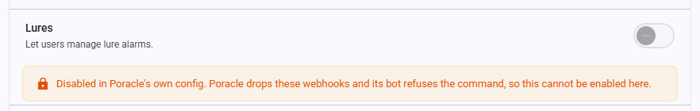
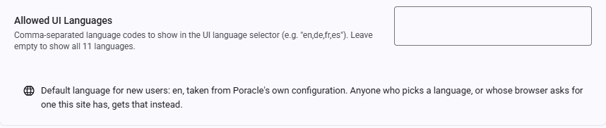

# Site Settings

Site settings are admin-configurable runtime settings stored in the `poracle_web.site_settings` database table. Unlike [appsettings.json configuration](reference.md) which requires a restart, site settings are changed at runtime via the **Admin > Settings** page and take effect immediately.

!!! info "First-time setup"
    On first startup after upgrade, the `SettingsMigrationStartupService` automatically migrates any existing data from the deprecated `pweb_settings` key-value store to the structured `site_settings` table. This is idempotent and safe to run multiple times.

## How it works

- Settings are stored in the `poracle_web.site_settings` table with columns: `category`, `key`, `value`, and `value_type`.
- The admin panel at **Admin > Settings** provides a grouped UI for editing all settings.
- Changes take effect immediately — no app restart is needed.
- Boolean settings use `"True"` / `"False"` string values.
- Keys beginning `disable_` store the *disabled* state, but the admin UI shows them as positive switches — the toggle is on when the feature is available. The stored value is inverted on read and write, so what the API and the tables below describe is the key, not the switch.
- Some settings have conditional visibility (e.g., `allowed_role_ids` only appears when `enable_roles` is enabled).

---

## Branding

Customize the appearance and navigation of your PoracleWeb.NET instance.

| Key | Label | Type | Description |
|---|---|---|---|
| `custom_title` | Site Title | string | Name shown in the browser tab and page header. One of the five keys served without authentication, alongside `enable_discord`, `enable_telegram`, `favicon_url` and `signup_url`. |
| `header_logo_url` | Header Logo URL | url | URL for a custom logo image in the header (replaces the default Pokeball). Leave empty for the default logo. |
| `hide_header_logo` | Hide Header Logo | boolean | Hide the logo from the header entirely. |
| `favicon_url` | Favicon URL | url | URL for the browser-tab icon. Square image recommended (32×32 minimum). Supports `.ico`, `.png`, and `.svg`. Leave empty to use the bundled default. Also loads on the public login page. See [Favicon caveats](#favicon-caveats) below. |
| `custom_page_name` | Nav Link Label | string | Label for a custom navigation link in the sidebar (e.g., "Back To Map"). Leave empty to hide. |
| `custom_page_url` | Nav Link URL | url | URL the custom nav link points to. |
| `custom_page_icon` | Nav Link Icon | string | FontAwesome class for the nav link icon (e.g., `fas fa-map`). |

### Favicon caveats

- **Browser cache.** Browsers cache favicons aggressively and often ignore normal reloads. After changing `favicon_url`, users must clear their browser cache or hard-refresh (<kbd>Ctrl</kbd>+<kbd>F5</kbd> / <kbd>Cmd</kbd>+<kbd>Shift</kbd>+<kbd>R</kbd>) to see the new icon. Mobile browsers may require removing and re-adding any home-screen bookmark.
- **Content Security Policy.** If the instance is served behind a reverse proxy or CDN that adds a CSP header, the favicon URL's origin must be allowed by the `img-src` directive. When the fetch is blocked, the browser silently falls back to the bundled default — the preview in the admin UI will show the error state to help diagnose this.
- **Supported formats.** `.ico`, `.png`, and `.svg` are reliably supported by current browsers. Avoid animated GIFs — support is inconsistent.
- **Hosting.** Any HTTPS URL works. If you want to serve the favicon alongside PoracleWeb itself, drop the file into the container's `wwwroot/` and reference it by relative path (e.g. `my-favicon.png`).

---

## Alarm Types

Control which alarm categories are available to users. Disabling a type hides it from the sidebar navigation and prevents access.

| Key | Label | Type | Description |
|---|---|---|---|
| `disable_mons` | Pokémon | boolean | Stops new Pokémon alarms and edits to existing ones. What a user already has stays listed and can still be deleted. |
| `disable_raids` | Raids | boolean | Stops new raid alarms and edits to existing ones. What a user already has stays listed and can still be deleted. |
| `disable_quests` | Quests | boolean | Stops new quest alarms and edits to existing ones. What a user already has stays listed and can still be deleted. |
| `disable_invasions` | Invasions | boolean | Stops new invasion alarms and edits to existing ones. What a user already has stays listed and can still be deleted. |
| `disable_lures` | Lures | boolean | Stops new lure alarms and edits to existing ones. What a user already has stays listed and can still be deleted. |
| `disable_nests` | Nests | boolean | Stops new nest alarms and edits to existing ones. What a user already has stays listed and can still be deleted. |
| `disable_gyms` | Gyms | boolean | Stops new gym alarms and edits to existing ones. What a user already has stays listed and can still be deleted. |
| `disable_fort_changes` | Fort Changes | boolean | Stops new fort-change alarms and edits to existing ones. What a user already has stays listed and can still be deleted. |
| `disable_maxbattles` | Max Battles | boolean | Stops new max-battle alarms and edits to existing ones. What a user already has stays listed and can still be deleted. |

!!! info "Disabling a type does not hide what people already have"
    Switching a type off blocks new alarms and edits to existing ones. It does not hide the page: the
    rules a user already created stay listed, and they can still delete them.

    That is deliberate. An alarm of a disabled type can never fire, so the useful thing left to do
    with it is remove it, and hiding the page would leave people holding rules they could neither see
    nor clear.

    The page says which side switched it off, and the create, edit, bulk-distance and test-alert
    controls are gone. Deleting is untouched.

    The sidebar item goes, since a padlocked entry to an empty page is noise for everyone who never
    used that type. The way back in is the dashboard, which keeps that type's card — marked, and
    linking through as usual — for as long as the user still has alarms on it. Delete the last one and
    the card goes too.

!!! warning "Poracle can switch these off too, and it wins"
    Poracle has its own per-type flags (`disable_pokemon`, `disable_raid`, `disable_quest`, `disable_invasion`, `disable_lure`, `disable_nest`, `disable_gym`, `disable_max_battle`, `disable_fort_update`). When one of those is set, its processor drops the webhook and its bot refuses the command, so the type can never fire — and this site now honours that. A type is off if **either** side disables it.

    The toggle for a type Poracle has disabled renders off and greyed, with a note saying where the decision came from; switching it on here would promise something every write refuses. This is also the case where leaving existing alarms deletable matters most: Poracle's bot refuses the matching command while the type is off, so this page is the only place left to clean up.

     Your own toggles still work for everything Poracle leaves enabled, and they gate features Poracle has no opinion about.

    If Poracle is unreachable, or too old to report its flags, the settings on this page are in sole charge — the gate fails **open** rather than disabling every type because a server was down.

---

## Features

Toggle user-facing features on or off.

| Key | Label | Type | Description |
|---|---|---|---|
| `disable_areas` | Areas | boolean | Prevent users from managing their area subscriptions. |
| `disable_profiles` | Profiles | boolean | Prevent users from creating and switching alarm profiles. |
| `disable_location` | Location | boolean | Gates the whole location API, not just the pin. Users cannot set their pin, and saved places, static and distance map images, and the weather lookups on the dashboard all stop with it. Since "Near a place" delivery scope measures from a saved place or the pin, alarms already using it keep working but nothing new can be pointed at a place. |
| `disable_nominatim` | Geocoding | boolean | Stops all outbound geocoding. The address search and reverse lookup return 403, and the location dialog hides its search box. Users can still set a pin by coordinates or on the map. Turn this on if you do not want your instance making requests to a third-party geocoder. |
| `disable_update_check` | Do not check for updates | boolean | Stops the version check against `api.github.com` and `raw.githubusercontent.com`, which runs when an admin opens the Versions card and is cached six hours afterwards. Two anonymous GETs, no identifiers and no payload. With it on, the Versions card on **Admin > Settings** still reports the running versions but cannot say whether they are current. |
| `disable_user_geofences` | Custom Geofences | boolean | Hides the My Geofences page and the admin review queue, and 403s the create, rename, import, submit, activate and deactivate endpoints. Delete is deliberately left open, so a user can still clear out a geofence they no longer want. Geofences that already exist keep being served in the [geofence feed](../features/custom-geofences/index.md) and keep matching. See [Admin operations](../features/custom-geofences/admin-operations.md). |
| `enable_templates` | Templates | boolean | Allow users to choose notification message templates. |
| `allowed_languages` | Allowed UI Languages | csv | Comma-separated language codes users can select (e.g., `en,de,fr`). Leave empty to show all 11 languages. Applies to the signed-out login page as well. English is always available. |

Beneath that row the page reports Poracle's own configured locale, which is the language a
first-time visitor lands on when neither a stored choice nor their browser can answer. It is read
from Poracle and cannot be set here — see [Values that are not settings](#values-that-are-not-settings).

---

## Administration

Access control.

| Key | Label | Type | Description |
|---|---|---|---|
| `enable_roles` | Enable Role-Based Access | boolean | Only allow users with specific Discord roles to log in. Requires `Discord:BotToken` and `Discord:GuildId` in [appsettings](reference.md). |
| `allowed_role_ids` | Allowed Role IDs | csv | Comma-separated Discord role IDs (e.g., `123456789,987654321`). A user needs **at least one** of these roles to log in. Leave empty to allow all. Only visible when `enable_roles` is enabled. |

!!! warning "Role-based access prerequisites"
    Role-based access requires `Discord:BotToken` and `Discord:GuildId` to be configured in appsettings. Without these, role checks cannot be performed and the setting has no effect.

!!! note "Formatting `allowed_role_ids`"
    Enter the IDs bare: `123456789,987654321`. Surrounding quotes are stripped, but any entry that is not a numeric Discord role ID is ignored and logged as a warning. If nothing usable is left, non-admin logins are denied with `role_check_failed` rather than silently allowing everyone. Admins can always log in, so a bad value can be corrected from the admin panel.

---

## Discord

| Key | Label | Type | Description |
|---|---|---|---|
| `enable_discord` | Enable Discord Login | boolean | Allow Discord sign-in. Requires `Discord:ClientId` and `Discord:ClientSecret` in [appsettings](reference.md). Nothing here affects PoracleNG's bot delivery — it only controls the login button. |

!!! note "Admins are exempt"
    The check runs only for non-admins, and only when the value is explicitly `"false"`. An absent key
    allows Discord login. Admins can always sign in with Discord, so switching this off by mistake is
    recoverable from the admin panel rather than a lockout.

---

## Telegram

Configure Telegram authentication alongside or instead of Discord.

| Key | Label | Type | Description |
|---|---|---|---|
| `enable_telegram` | Enable Telegram Login | boolean | Allow users to log in and manage alarms via Telegram. |
| `telegram_bot` | Bot Username | string | Telegram bot username (without the `@` prefix). Used as a **fallback** — see the note below. |

!!! note "Backend configuration also required"
    Enabling Telegram in site settings also requires `Telegram:BotToken` and `Telegram:BotUsername` to be set in [appsettings](reference.md).

!!! info "`telegram_bot` is a fallback, not an override"
    The login widget takes its bot username from `Telegram:BotUsername` (`TELEGRAM_BOT_USERNAME`) when
    that is set, and falls back to this setting when it is not. Configuration deliberately wins: before
    v2.14.0 nothing read this field at all, so a deployment may hold a stale value someone typed in while
    it was inert, and letting that override a working environment variable would break Telegram login.

---

## Authentication

Runtime toggles for the generic external SSO / OIDC sign-in flow. See [External SSO / OIDC](external-sso.md) for the full provider setup and [OIDC Refresh Tokens](oidc-refresh-tokens.md) for silent session refresh.

| Key | Label | Type | Description |
|---|---|---|---|
| `enable_oidc` | Authentication Mode (Local ⇄ SSO) | boolean | Controls the admin **Authentication** Local ⇄ SSO mode switch. **Opt-in:** SSO is active only when this is explicitly the string `"true"`. When the setting is **absent** (or `"false"`), the instance stays in **Local mode** — this is the default. Admins can always sign in via local auth even when SSO is on, so they can switch the mode back if the provider breaks. |
| `enable_oidc_slo` | Single Logout (Sign Out Everywhere) | boolean | Toggles RP-initiated single logout ("Sign out everywhere"). When **absent** this is **on** once an end-session endpoint is configured (`OIDC_END_SESSION_URL` in [appsettings](reference.md)). Set to `"false"` to disable single logout and fall back to a local logout. |

!!! note "Absent = default"
    These two settings differ from most boolean toggles on this page: their behaviour depends on whether the key is **present**. `enable_oidc` defaults **off** (Local mode) and must be explicitly `"true"` to enable SSO. `enable_oidc_slo` defaults **on** once an end-session endpoint is configured in [appsettings](reference.md), and only turns off when explicitly set to `"false"`.

!!! info "Silent refresh has no runtime toggle"
    Whether silent session refresh is active is controlled solely by the `OIDC_USE_REFRESH_TOKENS` [appsettings](reference.md) flag — there is intentionally **no** `enable_oidc_refresh` site setting. Refresh is coupled to the per-login JWT lifetime, so it's a deploy-time decision (turning it off at runtime would strand the short-lived tokens of users who are already signed in). See [OIDC Refresh Tokens](oidc-refresh-tokens.md).

---

## Analytics & Links

| Key | Label | Type | Description |
|---|---|---|---|
| `signup_url` | Signup URL | url | External registration page. When set, someone who reaches the login page without a Poracle account gets a sign-up button pointing here. Served on the public login page before anyone signs in, so treat it as public. Leave empty to hide the button. |

---

## Retired keys

Ten keys were withdrawn from the admin UI once it became clear nothing in the product read them. They
saved, persisted and read back while their descriptions promised behaviour the app does not have:

`disable_geomap`, `disable_geomap_select`, `register_command`, `location_command`, `provider_url`,
`gAnalyticsId`, `patreonUrl`, `paypalUrl`, `site_is_https`, `debug`.

Existing rows are left in `site_settings` rather than deleted, and the settings UI filters them out of
its "Other" catch-all. Nothing reads them, so their values have no effect either way. See #547, #560
and #589.

`disable_geomap` and `disable_geomap_select` are legacy PoracleJS keys describing a map picker this app
does not have. `provider_url` still exists in the Poracle bot's own config, which is where the geocoder
URL is actually read from — the site setting was a duplicate that fed nothing.

---

## Icon Repository

Icon URLs are configured via the visual **Icon Repository** picker in the admin settings UI. The picker sets all icon URLs at once from a preset repository. You can also set them individually.

| Key | Type | Description |
|---|---|---|
| `uicons_pkmn` | url | Base URL for Pokémon icon images. |
| `uicons_gym` | url | Base URL for gym icon images. |
| `uicons_raid` | url | Base URL for raid icon images. |
| `uicons_reward` | url | Base URL for reward/quest icon images. |
| `uicons_item` | url | Base URL for item icon images. |
| `uicons_type` | url | Base URL for type icon images. |

Built-in icon repositories include:

- **Whitewillem (Ingame)** — In-game style assets
- **Nileplumb (Home)** — Pokémon HOME style
- **Nileplumb (Shuffle)** — Pokémon Shuffle style
- **Jms412 (Home)** — Alternative HOME style
- **Jms412 (Pokedex)** — Pokédex style

All repositories use the [UICONS](https://github.com/UIcons/UIcons) standard format.

---

## Internal Settings

The following settings exist in the database but are **not shown** in the admin settings UI. They are
managed automatically by the application and should not be modified manually.

`migration_completed` is blocked by the API for both reads and writes. `quick_picks_seeded` is not: the
SPA's auto-seed guard has to read it, so admins receive it from `GET /api/settings` and it is hidden in
the UI layer instead. Neither is visible to non-admins.

| Key | Category | Description |
|---|---|---|
| `migration_completed` | system | Sentinel flag indicating that the one-time data migration from `pweb_settings` to structured tables has completed. Set automatically by `SettingsMigrationStartupService`. |
| `quick_picks_seeded` | admin | Sentinel flag indicating that the built-in quick picks have been created once. Written by `POST /api/quick-picks/seed` after a successful seed, and backfilled at startup for installations that already hold global picks. Without it an admin who deliberately deletes every preset gets them all back on their next visit. Admin-readable via the API (the SPA guard needs it) but hidden from the settings UI. |

## Values that are not settings

Some keys arrive on the settings response without being stored anywhere. They are **projections** of
another system's configuration, present so the SPA can read them like any other value.

| Key | Source | What it is |
|---|---|---|
| `poracle_locale` | Poracle's `general.locale` | The language a first-time visitor lands on, when neither a stored choice nor their browser can answer. See [Internationalization](../features/internationalization.md). |

A projection is read fresh from Poracle, cached briefly, and **cannot be written**. `PUT /api/settings/poracle_locale`
answers 400, and the admin page renders the value as a read-only line under Allowed UI Languages
rather than as an editable box. The refusal matters more than it looks: a stored row would take
precedence over the projected value, so a single accidental save would pin the language default
permanently and stop the site tracking Poracle's configuration at all.

There is also `GET /api/settings/upstream-disabled`, which lists the `disable_*` keys Poracle's own
config is forcing off. Any signed-in user can read it — the nav and the route guards need it — and it
is empty when Poracle is unreachable.

---

## Sensitive Settings

Credential-bearing rows carried over from PoracleJS installs. They are hidden from the admin settings
UI groups but **are** readable by admins through the API. Prefer configuring the equivalents via
[appsettings](reference.md) environment variables instead.

| Key | Category | Description |
|---|---|---|
| `api_address` | api | Poracle API address. Prefer `Poracle:ApiAddress` in [appsettings](reference.md). |
| `api_secret` | api | Poracle API shared secret. Prefer `Poracle:ApiSecret` in [appsettings](reference.md). |
| `telegram_bot_token` | telegram | Telegram bot token. Prefer `Telegram:BotToken` in [appsettings](reference.md). |
| `scan_dbhost`, `scan_dbport`, `scan_dbname`, `scan_dbuser`, `scan_dbpass` | other | Scanner database host, port, name, user and password. Prefer `ConnectionStrings:ScannerDb` in [appsettings](reference.md). |
| `cf_id`, `cf_secret` | other | Cloudflare Access service token used by some PoracleJS deployments. |

Neither the scanner keys nor the Cloudflare pair appear in `SettingsMigrationService.CategoryMap`, so rows migrated from `pweb_settings` land in the catch-all `other` category.

`GET /api/settings` decides what a non-admin sees with an **allowlist**, not a denylist: the exact keys
in `SettingsController.UserVisibleKeys` plus anything beginning `disable_`, `enable_` or `uicons_`.
Everything else is admin-only. That direction matters — the previous denylist named a key `scan_db`
that matches no real row and never mentioned `cf_id` / `cf_secret`, so a scanner password and a
Cloudflare token were served to every signed-in session. With an allowlist, a new credential key is
hidden until someone deliberately adds it.
