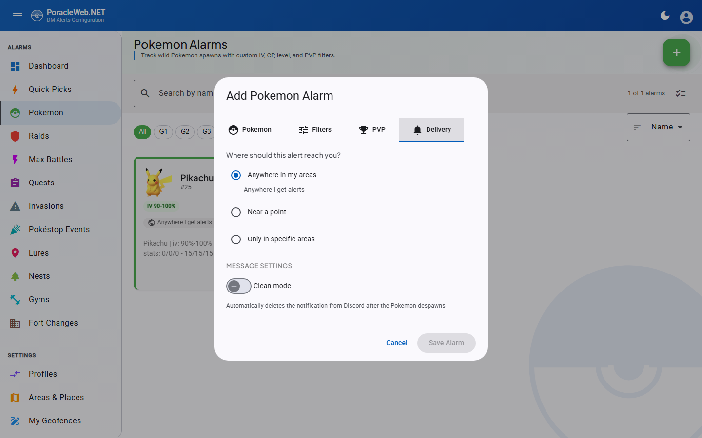
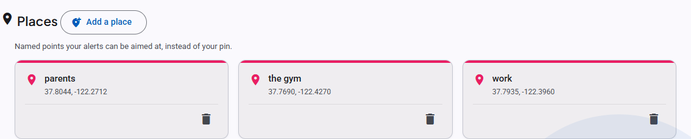
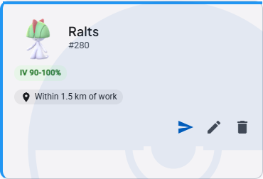
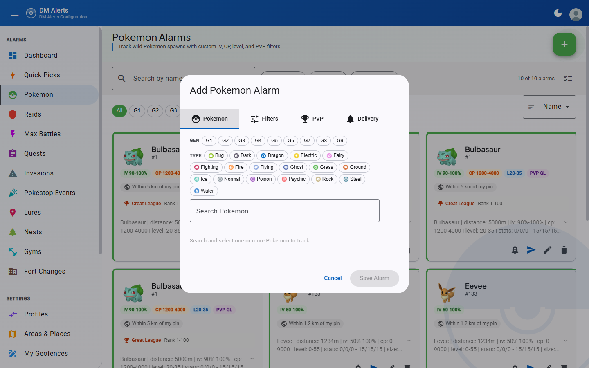
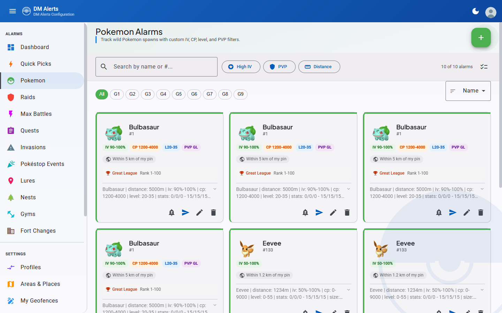
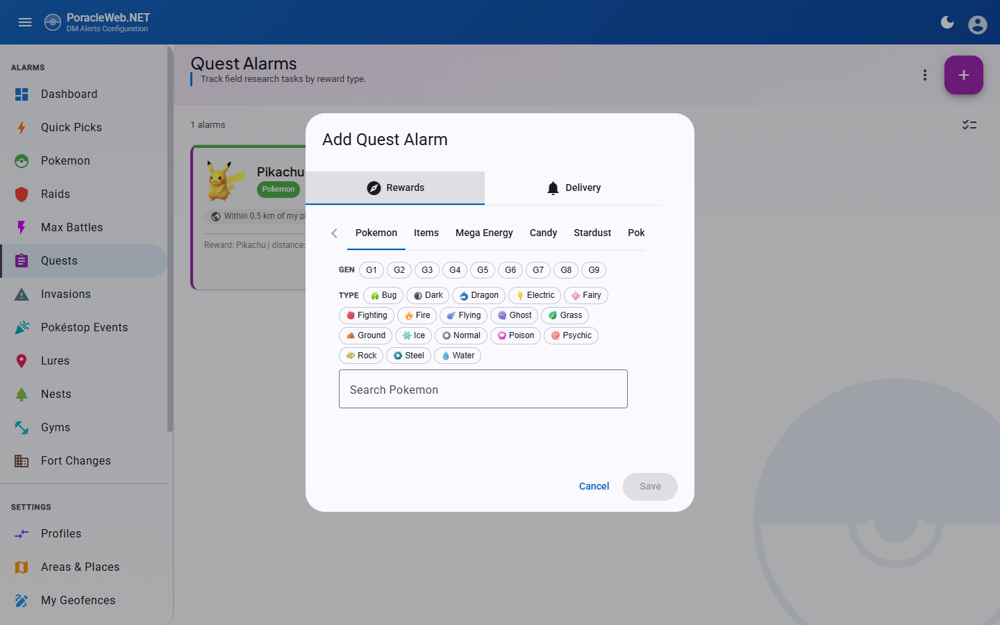
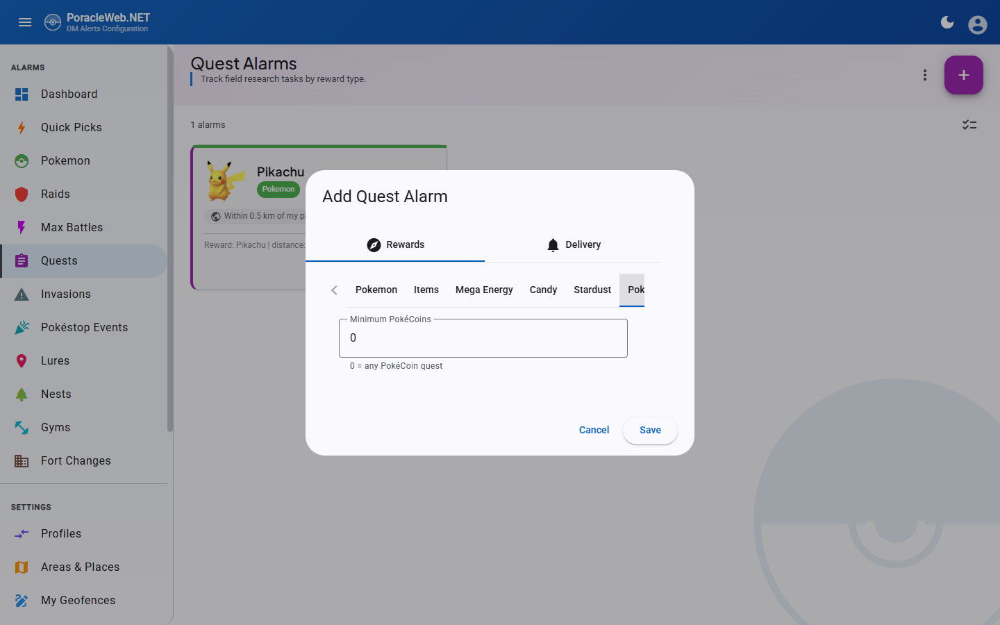
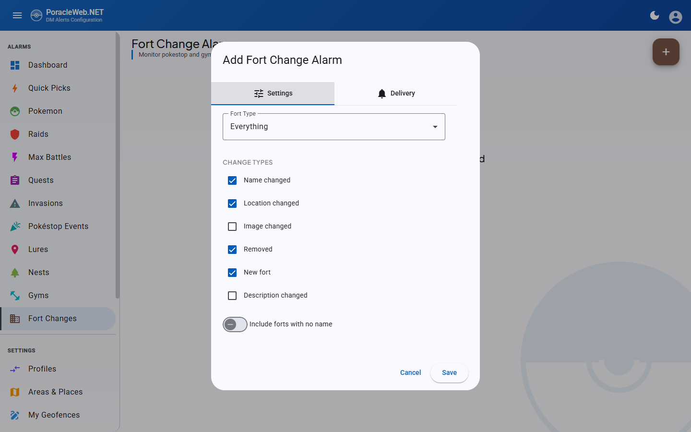
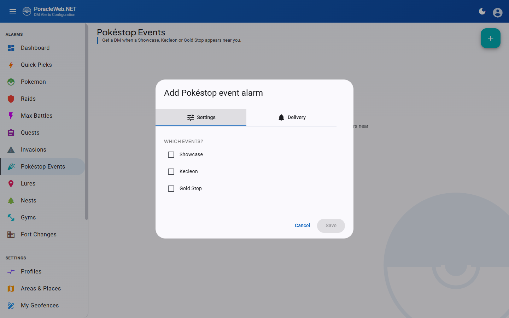
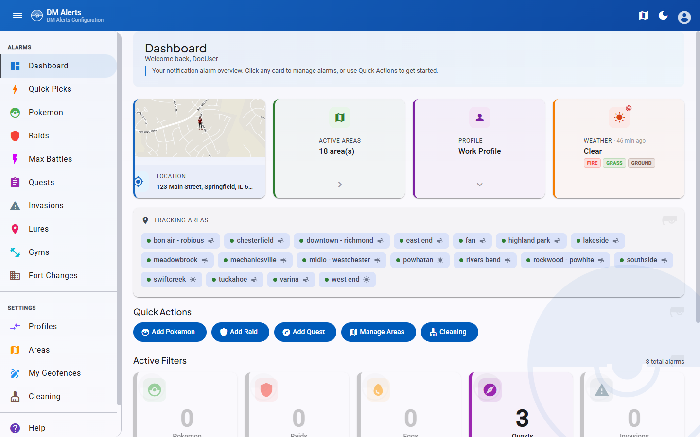

# Alarm Management

PoracleWeb.NET provides a browser-based UI for managing Poracle notification filters. Users create alarms that tell Poracle which Pokemon, Raids, Quests, and other events to send as DM notifications.

All alarm CRUD operations are proxied through the PoracleNG REST API. PoracleNG handles field defaults, deduplication, and immediate state reload. See [PoracleNG API Proxy](../architecture/poracleng-proxy.md) for technical details.

## Alarm types

| Type | Description |
|---|---|
| **Pokemon** | Filter by species, IV, CP, level, PVP rank, gender, size, costume. See [Costume filter](#costume-filter). |
| **Raids** | Filter by raid boss, level, move, evolution, costume, EX eligibility, specific gym, RSVP notification mode. See [Raid level selector](#raid-level-selector) and [Costume filter](#costume-filter). |
| **Eggs** | Filter by egg level, EX eligibility, specific gym, RSVP notification mode. See [Raid level selector](#raid-level-selector). |
| **Quests** | Filter by reward — Pokemon encounter, item, mega energy, candy, stardust or PokéCoins — with an optional minimum amount. See [Quest alarm filters](#quest-alarm-filters). |
| **Invasions** | Filter by grunt type and shadow Pokemon |
| **Pokéstop Events** | Showcase, Kecleon and Gold Stop events at a pokestop. See [Pokéstop Event alarms](#pokestop-event-alarms). |
| **Lures** | Filter by lure type |
| **Nests** | Filter by nesting Pokemon species |
| **Gyms** | Filter by gym team changes, battle activity, specific gym |
| **Fort Changes** | Filter by fort type (pokestop/gym), change types (name, location, image, description, removal, new) |
| **Max Battles** | Filter by battle level (1-5 Dynamax, 7/8 Gigantamax), specific Pokemon, Gigantamax-only toggle |

## Creating alarms

Each alarm type has a dedicated page accessible from the sidebar navigation. The creation flow:

1. Click the **+** (add) button
2. Select the Pokemon/raid/quest target using the selector dialog
3. Configure filter options (IV range, CP range, level, etc.)
4. On the **Delivery** tab, answer "Where should this alert reach you?" — see [Where an alert reaches you](#where-an-alert-reaches-you)
5. Optionally select a **template** for notification formatting
6. Save the alarm

## Editing alarms

Open an alarm's edit dialog from its card. Changing anything and saving replaces the rule upstream.

!!! note "An edit gives the alarm a new internal id"
    PoracleNG implements an alarm edit as a delete followed by an insert, so the row comes back under a
    new `uid`. Pokemon used to be the one type this did not apply to; on PoracleNG 5.2.0 and newer it
    now behaves like the other ten. This is invisible in normal use — the card, its filters and its
    scope are all unchanged — and [Quick Pick](#quick-picks) applied state is remapped to follow the new
    id, so a pick's remove button keeps working on a rule you have since edited.

## Where an alert reaches you

Every alarm answers the same question, and the **Delivery** tab of every add and edit dialog asks it outright: *Where should this alert reach you?* Three options, one radio group.

| Option | What it means |
|---|---|
| **Anywhere in my areas** | The alarm inherits whatever areas the active profile subscribes to. This is the default and the behaviour every alarm had before per-alarm scope existed. |
| **Near a point** | A radius around one fixed point. **Measured from** picks the point: your pin, or any [saved place](#saved-places). **Add a place** in the same select opens the map picker without losing the alarm you are editing. |
| **Only in specific areas** | A list of areas for this alarm alone. It *replaces* the profile's area list rather than narrowing it, and geofences you drew yourself are offered alongside the admin areas. |

The three are exclusive rather than combinable, because PoracleNG refuses every mixture of them: a place with areas, areas with a radius, and a place without a radius are all rejected upstream. Modelling the choice as a radio group means those states can't be typed in the first place.

Under the hood the picker writes three fields. "Anywhere in my areas" clears both overrides and sends `distance = 0`. "Near a point" sends the radius in metres, plus `override_location_label` when a saved place is chosen and nothing when the pin is. "Only in specific areas" sends `override_areas` and forces `distance` to 0. Both overrides are always sent explicitly, including empty, because a null means "leave what's stored" on the write path. Without that you could set an override and never take it off.

If you choose "Near a point" without ever having set a pin, the picker says so and offers a **Set your pin** button in place, rather than saving an alarm that measures from 0,0.

!!! warning "Needs PoracleNG 5.1.0"
    `override_location_label` and `override_areas` arrive in PoracleNG 5.1.0. On an older server the columns don't exist, so the scope picker saves without complaint and changes nothing. PoracleWeb logs an error at startup and reports the detected version on **Admin → Settings**.

!!! note "Your own geofences work here"
    PoracleWeb serves user-drawn geofences with `userSelectable: false` to keep them out of the bot's `!area` picker, and PoracleNG rejects those names when they arrive in `override_areas`. PoracleWeb sends only the names PoracleNG will accept and writes the rest into the alarm row directly, so a geofence you drew can scope one alarm whether or not your profile subscribes to it. See [Custom geofences](custom-geofences/key-concepts.md).

### Saved places

A place is a named point ("home", "work", "the gym") that an alarm can measure from instead of your profile pin. They live on the **Areas & Places** page, below the pin and the area map. (`/places` still resolves; it redirects to `/areas`.)

Add one with **Add a place**: drop the marker, then name it. Names are yours to choose and are what an alarm's `override_location_label` refers to. Places are user-scoped, not profile-scoped.

Deleting a place that alarms still point at is refused. `DELETE /api/location/places/{label}` answers 409 with a `referencingRules` list, and the UI names the alarms so you know what to repoint first.

The API is three endpoints on `LocationController`, all gated by `disable_location`:

| Endpoint | Purpose |
|---|---|
| `GET /api/location/places` | Every place plus the profile pin, as `{ default, named }`. `default` is null when the user has never set a pin. |
| `POST /api/location/places` | Saves a place. A label PoracleNG refuses comes back as a 400 the dialog shows against the field. |
| `DELETE /api/location/places/{label}` | Deletes a place, or 409s with the alarms still using it. |

### Changing scope from a card

Most alarm cards carry a scope chip reading the alarm's answer back to you — "Anywhere I get alerts" when the profile has no areas selected, otherwise "Anywhere in my areas", "Within 2 km of Home", "Only in Terrigal, Erina". Clicking it opens the same picker in a small dialog, so one alarm's scope can be changed without opening its edit dialog. Pokemon, gym, invasion, lure, nest, fort-change and Pokéstop Event cards have the chip; raid, egg, quest and max-battle cards do not, so those are changed from their edit dialog.

## Default delivery scope (Alert Defaults)

By default, every new alarm opens pre-set to **Areas** (geofence-based — the alarm sends `distance = 0`). If you usually track by radius, you can change that default so new alarms open on **Distance** with a radius you choose, instead of switching the location mode and re-typing a distance on every add.

Open the **user menu** (your avatar, top-right) and select **Alert Defaults**:

- **Default mode** — choose **Areas** or **Distance** for new alarms.
- **Default distance** — when Distance is the default, the radius (0.1–100 km) used to pre-fill new alarms. A live delivery preview shows what the choice covers.
- **Measured from** — also Distance-only: the pin, or a [saved place](#saved-places) new alarms should measure from. Switching the default back to Areas clears it, since a place without a radius is a scope PoracleNG refuses.

The preference is **per-browser** (stored in `localStorage` under `poracle-default-alert-mode` / `poracle-default-alert-distance-km` / `poracle-default-alert-place`, the same pattern as the theme and language settings) and is read by the `AlertDefaultsService`. It seeds the scope picker in **every add-alarm dialog** and in the **[Quick Pick](#quick-picks) apply dialog**.

!!! note "Applies to new alarms only"
    Alert Defaults only changes what the add/apply dialogs open with. Existing alarms are untouched, and you can still set a different scope on any individual alarm before saving it. Because the preference lives in the browser, it does not sync across devices.

## Pokemon Availability

When a [Golbat scanner](../configuration/reference.md#golbat-api) is configured, the Pokemon selector shows which species are currently spawning in the wild. This helps users create alarms for Pokemon that are actually available to encounter.

### How it works

1. The backend fetches spawn data from Golbat's `GET /api/pokemon/available` endpoint
2. Results are cached for 5 minutes with a stale-data fallback if Golbat goes down
3. The frontend fetches availability via `GET /api/pokemon-availability` and auto-refreshes every 5 minutes in the background
4. The Pokemon selector renders availability indicators when data is available

### What the user sees

- **"Live > Spawning" filter toggle** — Appears below the Gen and Type filter rows. Click to filter the Pokemon list to only currently spawning species.
- **Green dot indicators** — Small green dots appear next to available Pokemon in both the autocomplete dropdown and tile grid view. Unavailable Pokemon show a muted gray dot.
- **Available-first sorting** — When any filter (Gen, Type, or Spawning) is active, currently spawning Pokemon sort to the top.
- **Species count** — A "X species active" label shows the total number of spawning species.

### Feature gating

The availability UI is **automatically hidden** when Golbat is not configured. No admin toggle is needed — the feature is infrastructure-driven.

**Configuration** — Set these environment variables in your `.env` to enable the feature:

- `GOLBAT_API_ADDRESS` — URL of the Golbat API (e.g., `http://localhost:9001`)
- `GOLBAT_API_SECRET` — Golbat API authentication secret

## Alarm cards

Alarms are displayed as a card grid. Each card shows:

- Pokemon sprite or raid/quest icon
- **Filter pills** — Quick-glance badges showing active filters (IV, CP, Level, PVP, Gender, Size, minimum time left)
- **Scope chip** — where the alert reaches you, in words: "Anywhere I get alerts", "Anywhere in my areas", "Within 2 km of Home", "Only in Terrigal, Erina". Click it to [change the scope from the card](#changing-scope-from-a-card)
- Template name
- **Targeted gym name** — Gym, Raid, and Egg alarm cards display the name of the targeted gym when a specific gym is selected (via the gym picker)
- **Rule summary** — see [What this rule does, in Poracle's words](#what-this-rule-does-in-poracles-words)
- Edit/delete actions, and on the types that name a subject, a [quiet chip](quiet-periods.md)

### What this rule does, in Poracle's words

Under a hairline below the filter pills, each card carries the sentence PoracleNG itself uses to
describe that rule. It states things the pills leave out — attack and defence floors, weight, the PVP
CP cap — at the cost of restating some of what they already show. Long summaries are clamped to two
lines with an expand control.

Nine surfaces carry it: Pokemon, raids (both raid and egg cards), quests, invasions, lures, nests,
gyms and Max Battles. Fort Changes does not, because upstream renders a raw JSON array there rather
than a sentence. Pokéstop Events has no line either.

The sentence follows your **Alert language**, not your display language, because Poracle writes it.
When the two differ the line is hidden entirely rather than putting one language's prose under another
language's chips. It is also absent on a Poracle too old to send the field, in which case the card is
exactly what it was before. Nothing extra is fetched for it — the field was already on the response.

## Bulk operations

Each alarm list page has a **select mode** toggle (checklist icon in the toolbar):

1. Toggle select mode on
2. Check individual alarms or use **Select All**
3. The bulk toolbar appears with available actions:
    - **Update Distance** — Set a new distance for all selected alarms
    - **Delete** — Remove all selected alarms

!!! tip "Bulk distance uses the PoracleNG API"
    Bulk distance updates fetch all matching alarms from PoracleNG, modify the distance field, and POST them back. This ensures PoracleNG validates the data and triggers a state reload.

## Profiles

Users can maintain multiple alarm profiles. Only one profile is active at a time.

- The **Profiles** page shows all alarms across all profiles in a unified overview
- Switch profiles, edit, duplicate, delete, export, and import — all from one page
- Each alarm is associated with a `profile_no`
- The active profile is tracked by `humans.current_profile_no`

### Cross-Profile Overview

The Profiles page uses PoracleNG's `GET /api/tracking/allProfiles/{id}?includeDescriptions=true` endpoint to fetch all alarms across all profiles in a single call. Alarms are grouped by profile (expandable accordion panels) and by type within each profile.

### Duplicating a profile

The **Duplicate** button on each profile panel creates a new profile with all alarms copied from the source profile:

1. Click the :material-content-copy: **Duplicate** button on any profile panel
2. Enter a name for the new profile (pre-filled as `"<source name> (Copy)"`)
3. Click **Duplicate**

The new profile inherits the source profile's areas, location, and all alarm filters. If the alarm copy step fails, the empty profile is automatically rolled back (deleted) so the user never ends up with a shell profile.

!!! tip "Duplicate vs. Create"
    Use **Duplicate** when you want to start with an existing set of alarms and tweak them. Use **Create** when you want a blank profile.

### Profile Backup & Restore

- **Export**: Per-profile JSON backup containing all alarm filters, stripped of internal fields (`uid`, `id`, `profile_no`). File format: `{ version: 1, exportedAt, profileName, alarms: { pokemon: [...], raid: [...], ... } }`
- **Import**: Upload a backup file to create a new profile with all alarms restored. Profile names are auto-deduplicated if a matching name already exists.

### Profile Name Uniqueness

Profile names must be unique per user. Validated client-side in all entry points (add, edit, duplicate, import dialogs). Server-side auto-deduplication appends a numeric suffix as a fallback.

## Pokemon alarm filters

### Size filter

The size filter uses special sentinel values:

- **`size = -1`** — No filter (ALL sizes). This is the default.
- **`size = 1`** through **`size = 5`** — Specific sizes: 1 = XXS, 2 = XS, 3 = Normal, 4 = XL, 5 = XXL.
- **`max_size = 5`** — Default upper bound.

When a user selects a specific size, both `size` and `max_size` are set to the same value, creating an exact match. For example, selecting XXL sets `size = 5, max_size = 5`.

### Costume filter

A **Costume** select sits beside Form in both Pokemon dialogs, and on raid alarms that name a specific
boss. Three kinds of answer, and the sentinels are not the ones used elsewhere on this page:

| Value | Means |
|---|---|
| `9000` | Any costume, including none. The default. |
| `0` | No costume — the plain form only. |
| *N* | That costume and no other. |

Note that `0` means "uncostumed" here, where on most other filters `0` means "any". The wildcard is
`9000`, matching the raid and move sentinels rather than the size filter's `-1`.

On raids the control appears on the **By Boss** tab of the add dialog only, and in the edit dialog only
for a rule that names a boss. A by-level raid rule is always "any costume": PoracleNG forces the boss
to the wildcard on those, so there is no species for a costume to belong to. Eggs have no costume
column at all.

Costume names come from the WatWowMap masterfile — the same file PoracleNG reads for its own costume
lookups — and are **English in every interface language**. A costume too new for that file shows as its
number rather than a name. See [Game data names](internationalization.md#game-data-names).

!!! warning "Needs PoracleNG schema 6 (Pokemon) or 7 (raids)"
    The costume column arrives in two separate PoracleNG database migrations: `monsters.costume` at
    migration 6 and `raid.costume` at migration 7. A server sitting between the two stores a costumed
    Pokemon rule and refuses a costumed raid rule, so the two controls are gated independently and the
    select is simply absent where the column is missing.

    PoracleWeb.NET reads the applied migration number from PoracleNG's `schema_migrations` table rather
    than trusting the version string, because a self-hoster may cherry-pick and a locally built binary
    reports `0.0.0`. A server that does not answer unlocks neither.

    A costume that reaches the API anyway — through profile import or a Quick Pick — is refused with
    *"This Poracle server cannot store a costume filter. It needs the costume column (PoracleNG schema
    6)."* Create, update and the bulk path all enforce it, so nothing slips in by a side door.

### Level range

The default maximum level is **55** (not 40 or 50), matching Poracle's support for shadow/purified/best-buddy boosted levels.

### Minimum time left

Under **More Filters**, **Minimum Time Left** skips spawns that will despawn before you could reach them. The field is a select rather than a free number, offering Any, 1, 2, 5, 10, 15 and 20 minutes. PoracleNG stores seconds (`min_time`), and a free field invited two silent failures: typing `5` meaning minutes asks for five seconds, and a value longer than a spawn lives mutes the alarm with no error. A value set from the bot that isn't one of the presets is kept and offered in the list rather than being overwritten on the next save.

When set, the card shows a "5 min left" pill alongside the IV and CP pills.

### PVP mega evolution

On the **PVP** tab, once a league is selected, **Mega evolution** chooses which form the rank applies to: Base, Mega, Mega X or Mega Y (`pvp_ranking_evolution` 0–3). Megas are ranked separately from their base forms, so a Mega rule will not match a base-form spawn. Pick Base unless you specifically want mega rankings.

The chosen form appears as a suffix on the card's PVP badge ("Great League · Mega X").

!!! warning "Needs PoracleNG 5.1.0"
    `pvp_ranking_evolution` arrives in PoracleNG 5.1.0. Below that the column doesn't exist and the toggle group saves without effect.

## Raid level selector

The raid and egg pickers share the `<app-level-selector>` chip component. The vocabulary follows the [WatWowMap masterfile](https://github.com/WatWowMap/Masterfile-Generator/blob/main/master-latest-poracle-v2.json) — the same source PoracleNG uses for in-DM notification text — so the names you see in the picker match what users receive in their alerts.

**Raid picker.** Multi-select. Primary chip row shows the seven most common types: `1 Star`, `2 Star`, `3 Star`, `4 Star`, `Legendary` (level 5), `Mega` (level 6), `Mega Legendary` (level 7). A `Any` chip selects the wildcard sentinel (level 9000) that matches every raid level. A **More raid types…** overflow menu surfaces the other 12 canonical types: `Ultra Beast` (8), `Elite` (9), `Primal` (10), `1–5 Shadow` (11–15), `4–5 Super Mega` (16–17), `Coordinated 1–2` (18–19).

**Egg picker.** Multi-select. Only the five Star tiers (1–5) are surfaced — Pokémon GO has no Mega/Shadow/Primal eggs.

**The "By Boss" tab has no level picker.** PoracleNG forces `level` to the wildcard 9000 for any raid
alarm carrying a specific `pokemon_id` (`trackingRaid.go`), so a level chosen alongside a boss could never
survive the request. The tab used to show a picker whose value was always discarded; it was removed in
v2.14.0. Track a boss to be alerted at whatever level it appears.

**`+ Add`.** Both pickers expose an inline numeric input for any positive integer not in the canonical list. Useful for forward compatibility — if Niantic introduces a new raid type (`raid_20`) before PoracleWeb.NET ships an update, you can already alarm on it. Typed values are **ephemeral** to the dialog session: close the dialog (or refresh the page) and the chip is gone. Saved alarms at custom levels re-seed the chip when you open the edit dialog.

The canonical list is served by the API at `GET /api/masterdata/raid-levels` (cached server-side; baked-in fallback if the masterfile fetch fails). Card titles like "All Mega Legendary Raids" compose by combining the modifier ("Mega Legendary") with the localized "Raids" suffix from `RAIDS.ALL_LEVEL_RAIDS`, so card text reads naturally without the doubled word that an unaltered masterfile string would produce.

## Raid alarm filters

Raid alarms support these fields beyond the basic level/boss selection:

| Field | Default | Description |
|---|---|---|
| `team` | `4` (any team) | Gym team controlling the raid |
| `move` | `9000` (any move) | Filter by raid boss move |
| `evolution` | `9000` (any) | Filter by evolution type (e.g., Mega, Primal) |
| `exclusive` | `false` | EX/exclusive raid flag |
| `gymId` | `null` (all gyms) | Track a specific gym by ID (set via gym picker) |
| `rsvpChanges` | `0` (matches only) | RSVP notification mode: `0` matches only, `1` matches + RSVP updates, `2` RSVP updates only. Selectable as a three-option toggle group in the raid add/edit dialog; shown as an "RSVP" / "RSVP only" status badge on raid cards (beside the auto-delete tag) when non-default. Selecting mode `1` or `2` also sets PoracleNG's edit-in-place bit (`clean` bit 2) so RSVP count changes edit the existing alert rather than sending a new message. Mode `2` requires the upstream scanner to emit RSVP webhooks — selecting it in deployments without one will silence the alarm. |

## Egg alarm filters

Egg alarms support:

| Field | Default | Description |
|---|---|---|
| `team` | `4` (any team) | Gym team controlling the egg |
| `exclusive` | `false` | EX/exclusive egg flag |
| `gymId` | `null` (all gyms) | Track a specific gym by ID (set via gym picker) |
| `rsvpChanges` | `0` (matches only) | RSVP notification mode: `0` matches only, `1` matches + RSVP updates, `2` RSVP updates only. Selectable as a three-option toggle group in the egg add/edit dialog; shown as an "RSVP" / "RSVP only" status badge on egg cards (beside the auto-delete tag) when non-default. Selecting mode `1` or `2` also sets PoracleNG's edit-in-place bit (`clean` bit 2) so RSVP count changes edit the existing alert rather than sending a new message. Mode `2` requires the upstream scanner to emit RSVP webhooks — selecting it in deployments without one will silence the alarm. |

## Quest alarm filters

A quest alarm matches one reward. Which of the six reward tabs you use decides the `reward_type` PoracleNG stores, and where the number you type ends up:

| Tab | `reward_type` | What you pick | Minimum field |
|---|---|---|---|
| Pokemon | `7` | Species the quest rewards (`reward` = pokemon id) | — |
| Items | `2` | The item (`reward` = item id) | `amount` |
| Mega Energy | `12` | Species whose energy is rewarded | `amount` |
| Candy | `4` | Species whose candy is rewarded | `amount` |
| Stardust | `3` | Nothing; the amount is the whole rule | `reward` |
| PokéCoins | `8` | Nothing; the amount is the whole rule | `reward` |

**Minimum Amount** is the fewest of the reward the quest has to give; `0` means any. It only applies where a reward comes in a quantity: items, candy and mega energy. A Pokemon encounter has nothing to count.

Stardust and PokéCoins work differently from the rest, and identically to each other. There is nothing to pick — Poracle matches on the amount alone — so each tab is a single number field, and PoracleNG reads the floor from `reward` rather than `amount`. On both, `amount` stays `0`.

Quest cards render the amount ahead of the reward name — "3× Rare Candy" — but only when it is above one; an amount of 1 shows the reward name on its own. Stardust cards read "25000 Stardust", from `reward`, and PokéCoin cards read the same way.

!!! warning "PokéCoins needs PoracleNG 5.2.0"
    The PokéCoins tab is rendered last and is **hidden entirely below 5.2.0**, so if you cannot find it,
    that is the reason. 5.2.0 widened PoracleNG's list of accepted reward types; it added no column and
    no capability flag, so this is one of the few gates decided by the reported version rather than by a
    database migration. A 5.1.0 server answers `400 "Unrecognised reward_type value"`.

    Reads and deletes are not gated, so a PokéCoin rule set from the Discord bot stays visible and
    removable on an older server.

## Gym alarm filters

Gym alarms support:

| Field | Default | Description |
|---|---|---|
| `team` | `4` (any team) | Gym team to track |
| `battleChanges` | `false` | Notify on battle activity changes at the gym |
| `gymId` | `null` (all gyms) | Track a specific gym by ID (set via gym picker) |

## Fort change alarm filters

Fort change alarms track changes to pokestops and gyms as points of interest (not activity at them). This includes name changes, location changes, image updates, description changes, removals, and new POI additions.

| Field | Default | Description |
|---|---|---|
| `fort_type` | `"everything"` | Fort type to track: `pokestop`, `gym`, or `everything` |
| `include_empty` | `0` (false) | Include forts with no name |
| `change_types` | `[]` (all) | JSON array of change types to monitor: `name`, `location`, `image_url`, `description`, `removal`, `new` |

Fort change alarms are proxied through PoracleNG using tracking type `"fort"`. The API endpoints follow the standard alarm CRUD pattern at `/api/fort-changes`.

## Max Battle alarm filters

Max Battle (Dynamax) alarms track battles at Power Spot stations. There are two tracking modes:

- **By Level** — Select battle tiers to track any Pokemon at those levels. One alarm per level.
- **By Pokemon** — Select specific Pokemon to track across all Max Battle levels.

| Field | Default | Description |
|---|---|---|
| `pokemon_id` | `9000` (any) | Pokemon to track. `9000` = level-based tracking (any Pokemon). |
| `level` | `9000` (any) | Battle level. Only meaningful when `pokemon_id = 9000`. |
| `gmax` | `0` (any) | Gigantamax filter. `0` = matches all battles, `1` = Gigantamax only. |
| `form` | `0` (any) | Pokemon form filter. |

### Battle levels

Max Battle levels follow the PoracleNG `util.json` definitions:

| Level | Label | Type |
|---|---|---|
| 1 | 1 Star Max Battle | Dynamax |
| 2 | 2 Star Max Battle | Dynamax |
| 3 | 3 Star Max Battle | Dynamax |
| 4 | 4 Star Max Battle | Dynamax |
| 5 | Legendary Max Battle | Dynamax |
| 7 | Gigantamax Battle | Gigantamax |
| 8 | Legendary Gigantamax Battle | Gigantamax |

!!! note "No level 6"
    There is no level 6 in PoracleNG's max battle system. Levels 7 and 8 are Gigantamax battles where `gmax` is automatically derived (level > 6 = gmax).

### Insert-only API behavior

Unlike other alarm types, the PoracleNG maxbattle API handler has **no diff/dedup logic** — every POST creates new rows. Updates use a delete-then-create pattern: delete the old alarm by UID, then insert the replacement. This is handled transparently by `MaxBattleService.UpdateAsync()`.

### Scanner-based Pokemon filter

When the scanner database is configured, the "By Pokemon" tab queries the `station` table for distinct `battle_pokemon_id` values. This limits the Pokemon selector to species that have actually appeared in Max Battles. If the scanner DB is not configured, all Pokemon are shown.

!!! warning "GymCreate.Team default"
    `GymCreate.Team` must default to `4` (any team), matching Raid and Egg defaults. A C# `int` defaults to `0`, which maps to "Neutral only" in Poracle, causing new gym alarms to silently filter out all non-Neutral gyms.

## Gym picker

The **gym picker** is a shared component (`app-gym-picker`) that allows users to optionally target a specific gym when creating or editing **Gym**, **Raid**, or **Egg** alarms. When a gym is selected, alerts only fire for events at that particular gym.

### How it works

1. The picker displays a search field labeled "Search for a gym (optional)".
2. As the user types (minimum 2 characters), the component debounces input (300ms) and queries the scanner database via `GET /api/scanner/gyms?search=<term>&limit=20`.
3. Results appear in an autocomplete dropdown. Each option shows:
    - **Gym photo thumbnail** (from the scanner DB), or a team icon fallback if no photo is available
    - **Gym name** (or gym ID if the name is not set)
    - **Area name** — resolved by checking which Koji geofence polygon contains the gym's coordinates (via point-in-polygon), or lat/lon coordinates if no area matches
4. Selecting a gym sets the `gymId` on the alarm. A compact chip displays the selected gym's photo, name, and area with a clear button to remove the selection.
5. In **edit mode**, the picker loads the existing gym's details from `GET /api/scanner/gyms/{id}` to display the name and photo.

### Requirements

- The **scanner database** must be configured (`ConnectionStrings:ScannerDb`). If not configured, the `IScannerService` is not registered and the search endpoints return empty results.
- The **Koji service** is optional. When available, it enriches results with area names by checking gym coordinates against Koji geofence polygons.

### Backend

- `ScannerController` exposes `GET /api/scanner/gyms` (search) and `GET /api/scanner/gyms/{id}` (lookup by ID).
- `IScannerService.SearchGymsAsync()` queries the scanner DB's gym table by name (LIKE match), returning `GymSearchResult` with `Id`, `Name`, `Url`, `Lat`, `Lon`, `TeamId`, and `Area`.
- Area enrichment runs server-side: for each gym result, the controller iterates Koji admin geofences and assigns the first matching fence name.

## Invasion alarm filters

Invasion alarms filter by grunt type. The `grunt_type` value is **automatically lowercased** on create because Poracle uses case-sensitive matching for grunt types.

## Pokéstop Event alarms

Showcases, Kecleon sightings and Gold Stops are the eleventh alarm type, on its own page at
**Pokéstop Events** in the sidebar, directly after Invasions.

| Event | Stored as | What it is |
|---|---|---|
| **Showcase** | `showcase` | A showcase running at a pokestop |
| **Kecleon** | `kecleon` | A Kecleon hiding on a pokestop |
| **Gold Stop** | `gold-stop` | A pokestop that has turned gold |

### Creating one

The add dialog has two tabs. **Settings** holds three checkboxes, one per event; an event you already
track is shown ticked and disabled, so you cannot create a duplicate. **Delivery** is the usual
[scope picker](#where-an-alert-reaches-you), auto-delete toggle and template selector.

Ticking more than one event creates one rule per event, not one rule covering several. The edit dialog
handles a single rule, so it offers one **Event** select rather than checkboxes.

### Eleven types, ten tables

Pokéstop Event rules live in the **same `invasion` table** as invasion rules; the two are told apart by
the stored `grunt_type`. Everything else follows from that.

When you first see the Pokéstop Events page, your **Invasions count drops** by however many event
rules you already had, and a Pokéstop Events count appears holding them. Nothing was created, deleted
or moved — the same rows are being counted in two piles instead of one, and the overall total is
unchanged.

The split is conditional. Where the feature is unavailable — an older Poracle, or `disable_showcase`
set — event rows stay listed and deletable under **Invasions**, and the invasion add dialog keeps
offering the three events. The dashboard counts agree with whichever page the rows are on.

The **Cleaning** page's invasion toggle sweeps event rows along with invasion rules, since it works on
the table.

### What this type does not do

- **No test alert.** There is no mock payload builder for events, so no card carries the test button.
- **No user-drawn geofence in the scope picker.** The override that lets an alarm point at a geofence
  you drew yourself exists only on the v1 tracking path, and this type is v2-only. Admin areas, a
  radius and a saved place all work.
- **Not in the cross-profile overview, export or import.** Pokéstop Event rules are absent from all
  three, so a profile export does not carry them and an import will not recreate them.

!!! warning "Needs PoracleNG 5.2.0 and `disable_showcase = false`"
    The page appears only when Poracle's configuration carries an explicit `general.disable_showcase =
    false`. Absent, unreadable, or set to true all mean the page is hidden.

    This is the one upstream probe in PoracleWeb.NET that **fails closed**, and deliberately so: a
    server without the option is a server below 5.2.0, and every one of those answers 404 on the route
    the page is built from. Showing the page on a guess would produce a page that only errors. Every
    other upstream flag fails open, on the reasoning that a Poracle outage must not switch off alarm
    types that work.

    Operators can also switch the type off here, independently of Poracle, with the **`disable_showcase`**
    site setting under **Admin → Settings → Alarms**.

## Delivery & message modes

Every alarm carries a `clean` field that PoracleNG reads as a **bitmask** controlling how the notification is delivered. PoracleWeb surfaces the bits the bot actually acts on as per-alarm toggles in the add/edit dialogs (and shows them as status badges on the alarm cards):

| Mode (`clean` bit) | Applies to | What it does |
|---|---|---|
| **Auto-delete** (bit 1) | all alarm types except Fort Changes | Deletes the Discord notification after the event expires (e.g. a Pokemon despawns or a raid ends). Toggle per-alarm in the dialog, or in bulk from the **Cleaning** page. PoracleNG has no `clean` column for fort changes, so the setting does not exist for that type. |
| **Edit message in place** (bit 2) | Lures; Raids/Eggs (via RSVP mode) | Updates the existing Discord message when the event changes instead of sending a new one. For lures, enable the **"Edit message in place"** toggle in the lure dialog; for raids/eggs it is set automatically when you choose an RSVP mode (see the `rsvpChanges` rows above). |
| **Daily summary** (bit 4) | Quests | Collects matching quests into a single summary message instead of one notification each. Enable the **"Daily summary"** toggle in the quest dialog. Requires a configured summary schedule on the bot. |

The modes combine (a quest can be both auto-delete and daily-summary, for example). PoracleWeb **preserves any bits set elsewhere** — if you configured a delivery mode via the bot's `!command` interface that isn't surfaced in the web UI, editing the alarm in the browser will not wipe it.

### RSVP updates (raids & eggs)

Raid and egg alarms add a third delivery setting on top of auto-delete and edit-in-place: an **RSVP notification mode**, stored in the `rsvpChanges` field (see the `rsvpChanges` rows under the raid and egg filter tables above). Choose it from the three-option toggle group in the raid/egg add/edit dialog:

- **Matches only** (`0`, the default) — standard raid/egg alerts only. You get one notification when a raid or egg matches, and nothing further.
- **Matches + RSVP updates** (`1`) — the same initial match alert, plus a re-notification whenever the RSVP count changes (trainers signing up to attend).
- **RSVP updates only** (`2`) — skips the initial match alert entirely and notifies you only when RSVP counts change.

Picking mode `1` or `2` also turns on PoracleNG's edit-in-place behavior (`clean` bit 2), so RSVP count changes **edit the existing Discord alert in place** rather than sending a fresh message each time — your DMs stay to a single, updating notification per raid. When a non-default mode is set, the alarm card shows an **"RSVP"** (mode `1`) or **"RSVP only"** (mode `2`) status pill beside the auto-delete tag.

> **Scanner caveat:** RSVP updates only arrive if the upstream scanner emits RSVP webhooks. In a deployment without one, mode `2` ("RSVP updates only") suppresses the initial match but never receives RSVP events — the alarm goes completely silent. Use mode `2` only if you know your scanner reports RSVPs.

## Default values

All monster (Pokemon) alarm defaults:

| Field | Default | Description |
|---|---|---|
| `min_iv` | `0` | Minimum IV percentage |
| `max_iv` | `100` | Maximum IV percentage |
| `min_cp` | `0` | Minimum CP |
| `max_cp` | `9000` | Maximum CP |
| `min_level` | `0` | Minimum level |
| `max_level` | `55` | Maximum level |
| `min_weight` | `0` | Minimum weight |
| `max_weight` | `9000000` | Maximum weight |
| `atk` | `0` | Minimum attack IV |
| `def` | `0` | Minimum defense IV |
| `sta` | `0` | Minimum stamina IV |
| `max_atk` | `15` | Maximum attack IV |
| `max_def` | `15` | Maximum defense IV |
| `max_sta` | `15` | Maximum stamina IV |
| `pvp_ranking_best` | `0` | Best PVP ranking position |
| `pvp_ranking_worst` | `4096` | Worst PVP ranking position |
| `pvp_ranking_evolution` | `0` | PVP form to rank against (0 = base, 1 = mega, 2 = Mega X, 3 = Mega Y) |
| `min_time` | `0` | Minimum seconds of despawn time left (0 = no filter) |
| `gender` | `0` | Gender filter (0 = any) |
| `size` | `-1` | Size filter (-1 = no filter / all sizes) |
| `max_size` | `5` | Maximum size upper bound |

Raid-specific defaults:

| Field | Default |
|---|---|
| `team` | `4` (any team) |
| `move` | `9000` (any move) |
| `evolution` | `9000` (any evolution) |

Egg-specific defaults:

| Field | Default |
|---|---|
| `team` | `4` (any team) |

Gym-specific defaults:

| Field | Default |
|---|---|
| `team` | `4` (any team) |

Max Battle-specific defaults:

| Field | Default |
|---|---|
| `pokemon_id` | `9000` (any Pokemon / level-based) |
| `level` | `9000` (any level) |
| `gmax` | `0` (any — not Gigantamax-only) |
| `move` | `9000` (any move) |
| `evolution` | `9000` (any — unused placeholder) |

## Test Alerts

Most alarm cards include a **test button** (send/paper plane icon) that triggers a sample notification for that alarm. This lets users verify their alarm filters and notification formatting without waiting for a real event to occur.

{ loading=lazy }

### How it works

1. Click the send icon in the alarm card's action area
2. PoracleWeb.NET builds a **mock webhook payload** using the alarm's actual filter values (e.g., pokemon_id, raid_level, quest_reward) and the user's saved location as the event coordinates
3. The payload is sent to PoracleNG's `POST /api/test` endpoint, which formats and delivers the notification to the user via their configured webhook
4. A **snackbar** displays the result: success, error, or cooldown warning

### Supported alarm types

Test alerts are available for eight of the eleven alarm types:

- Pokemon
- Raid
- Egg
- Quest
- Invasion
- Lure
- Nest
- Gym

**Not** Fort Change, Max Battle or Pokéstop Event — `TestAlertController` rejects all three, and none of
those modules renders a test button. They have no mock payload builder, so there is nothing to send.

### Rate limiting

Test alerts are rate limited to prevent abuse:

- **Server-side**: 5 requests per 60 seconds per IP address
- **Client-side**: 15-second cooldown per individual alarm (tracked by UID)
- In-flight request deduplication prevents duplicate API calls if the button is clicked rapidly

## Weather Display

The dashboard shows the current in-game weather conditions at the user's pin.

### Features

- **Current weather** — Displays the active in-game weather type at the user's pin
- **Last update timestamp** — Shows when the weather data was last refreshed
- **Area weather** — Weather conditions displayed for each of the user's selected areas
- **Automatic updates** — Weather data refreshes in the background

!!! note "Pin required"
    The weather display requires a saved pin to function. Users who have not set one will not see weather information on the dashboard. Set a pin on the **Areas & Places** page or through the onboarding wizard.

## Quick Picks

Admins can define **Quick Pick** templates — pre-configured alarm sets that users can apply with one click. Useful for onboarding new users or sharing recommended configurations.

When applying a Quick Pick, the apply dialog's **Delivery** tab holds the same [scope picker](#where-an-alert-reaches-you) the add dialogs use, seeded from your [Alert Defaults](#default-delivery-scope-alert-defaults). Whatever you choose there — areas, a saved place, a radius, or a specific set of areas — applies to every alarm the pick creates.

## Related

- [Quiet Periods](quiet-periods.md) — silence one gym, area, species or station for a while without
  touching the alarms themselves
- [Quest Summary Delivery](quest-summary-schedules.md) — collecting matching quests into one digest
- [Profiles](profiles.md) — keeping separate alarm sets and switching between them
- [PoracleNG Version Compatibility](../architecture/poracleng-compatibility.md) — which features need
  which server
