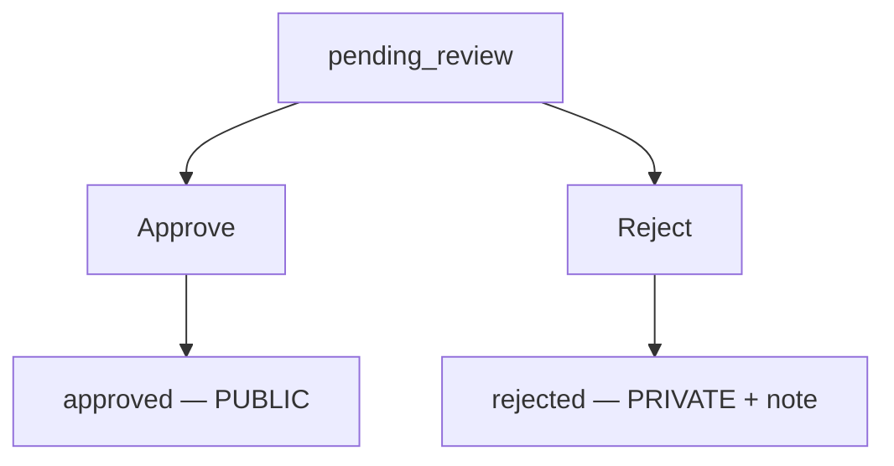

# Admin Operations

This page is the day-to-day admin reference: where to review submissions, how to approve/reject/delete, the optional Discord forum integration, and the limits that protect your deployment.

## The Geofence Submissions screen

Admins get a **Geofence Submissions** screen (under the admin area). It lists every user geofence with its status, owner, region, point count, and timestamps. Three view modes:

| View | Best for |
|---|---|
| **Card** | Visual review — each card shows a small map thumbnail, grouped by region. |
| **List** | A compact, region-grouped table. |
| **Table** | A flat, sortable table with every column (sort by name, status, owner, region, points, dates). |

Geofences with no region land in a **"No Region"** group, so nothing is hidden just because it lacks a region. Use the **status filter tabs** to focus — most of the time you'll filter to **pending_review** to see what's waiting on you.

## Reviewing a submission

Open a submission to see its shape on a map, who submitted it, and how many points it has. Then choose:

- **Approve** — promotes it to a public Koji area. You can set a cleaner public name and (optionally) a region. See the full effect in [Private geofences & promotion](private-and-promotion.md#step-3a-approve-the-actual-promotion).
- **Reject** — declines the request with a short reason. The geofence stays private for its owner.

### Choosing a region at approval time

If your Koji project has regions, the approval dialog shows a region picker, pre-filled with whatever region the submission already had. You can:

- **Keep it** — leave it as-is.
- **Change it** — file the area under a different region.
- **Clear it** — promote it as an ungrouped public area.

If your project has **no regions**, the picker simply doesn't appear, and the area is promoted ungrouped. You can always organize it in Koji afterward.

## Deleting geofences

Admins can delete any geofence from the admin screen:

- If it's a **private** geofence, it's removed from PoracleWeb.NET and from every profile that had it switched on.
- If it's an **approved (public)** geofence, PoracleWeb.NET also removes it from the Koji project so it stops being a selectable public area.

!!! warning "Project removal vs. full deletion"
    Removing a public geofence from the *project* stops it being selectable, but the geofence row may still exist in Koji's own database. To scrub it completely, delete it in the **Koji UI**. See [Troubleshooting](troubleshooting.md#removing-a-geofence-from-koji-completely).

## Optional: Discord forum integration

You can have PoracleWeb.NET open a **Discord forum thread** for each submission, so your admin team can discuss and track decisions in Discord. It's entirely optional — everything works without it.

| Config | What it does |
|---|---|
| `Discord:GeofenceForumChannelId` | The Discord **forum channel** where submission threads are created. Leave unset to disable. |
| `Site:PublicUrl` | Optional. The public URL of your site, no trailing slash. Makes the review card's title a link straight to the Geofence Submissions screen. The link is omitted when unset. |

### The review card

**On submit**, a thread is created titled after the geofence, tagged **Pending**, with a card built to be decided on without leaving Discord:

| Field | Why it's there |
|---|---|
| **Size** | Area in km² plus a plain-language band (`a block or two`, `neighbourhood`, `district`, `city-sized`, `very large`). This is the main gate — approving publishes the area to everyone, so a neighbourhood is fine and a whole metro usually isn't. The map alone can't tell you: a static map auto-zooms to fit, so a park and a county look identical. |
| **Region** | The auto-detected Koji parent region, or `Not detected`. |
| **Publishes as** | The lowercase name the area would take in the shared public list. This is what approval actually publishes, so `zz my house` and `Bowie - Melford` are worth telling apart before you click. |
| **Location** | Centroid coordinates with a maps link. Matters most when the region wasn't detected. |
| **Already covered by** | Only shown when the area's centre falls inside an existing public area, naming it, so duplicates are visible without opening a map. It's a centre-point test, not a true overlap measurement — a partial overlap won't trigger it. |

The submitter appears in the card's author line, with a clickable mention in the message above it. The map is uploaded to Discord as an attachment rather than linked, so it doesn't expire when the tile server drops its cached copy.

The colour bar tracks state: **amber** while pending, **green** approved, **red** rejected.

**On approve/reject**, PoracleWeb.NET rewrites the original card in place — new colour, updated footer, the published name, and on rejection the reason — then posts the outcome as a reply, retags the thread **Approved**/**Rejected**, and **locks and archives** it. Rewriting the opening post means anyone opening the thread later sees the outcome immediately instead of scrolling for it.

If Discord is unreachable or the channel isn't set, the submission still works — the geofence still moves to `pending_review`/`approved`/`rejected`. The forum post is a convenience, never a blocker. The same applies to the individual pieces: a failed map download falls back to linking it, a failed card rewrite still posts the outcome reply, and a Koji outage just omits the "Already covered by" line.

!!! note "Bot token and tags"
    PoracleWeb.NET uses the Discord bot token from your PoracleNG server's Discord bot configuration. The forum tags (`Geofence - Pending` / `Approved` / `Rejected`) are created automatically the first time they're needed. If you rename those tags in Discord, restart PoracleWeb.NET so it re-reads them.

## Limits that protect your deployment

These are built in to keep things sane — you don't configure them, but it helps to know them when a user asks why something was blocked:

| Limit | Value | Why |
|---|---|---|
| Geofences per user | **10** | Stops any one user flooding the system. |
| Points per polygon | **3 – 500** | A polygon needs at least 3 points; 500 caps absurdly detailed shapes. |
| Name | 1–50 characters, letters/numbers/spaces and `- ' . ( ) &` | Keeps names clean and bot-safe. |
| GeoJSON import | ≤ 5 MB, ≤ 50 shapes per file | Bulk-import guardrails. |

Duplicate names are handled automatically — if a user picks a name that's taken, PoracleWeb.NET appends a number (`downtown 2`, `downtown 3`, …).

## Turning the whole feature off

If you don't want user-drawn geofences at all, there's an admin site setting (`disable_user_geofences`) that hides the whole feature — the user *My Geofences* page, the admin review queue, and the create/submit/import endpoints. **Existing** geofences keep working; this just freezes new ones. Toggle it from the admin **Settings** page.
