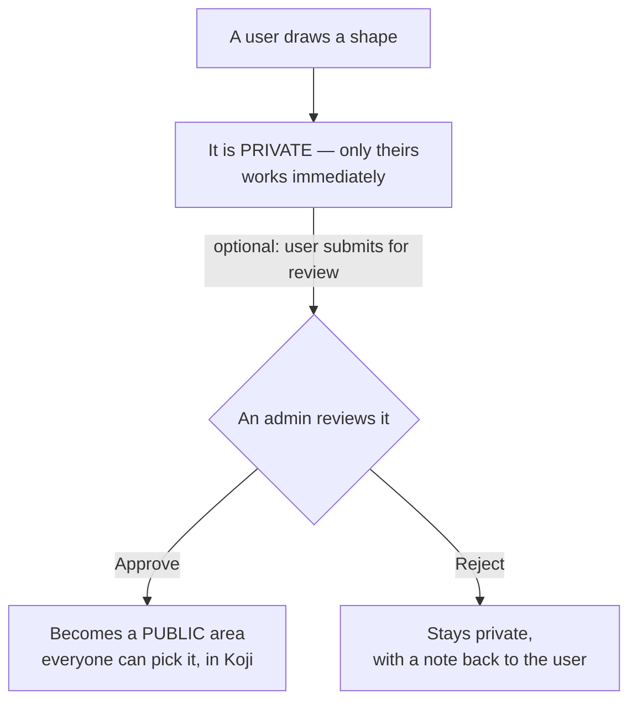
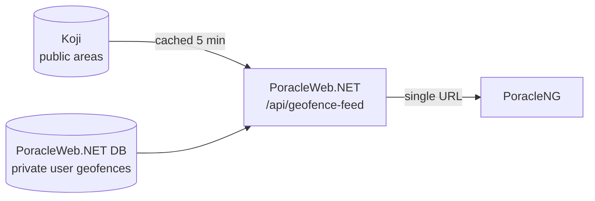

# Custom Geofences

This section is for **operators deploying and running PoracleWeb.NET** — the person who configures the server, connects it to Koji, and approves user submissions. It explains how custom geofences work, how they connect to Koji, and how to set everything up so your users can draw their own notification zones.

You do not need to read the code to use this guide. Where something is a value you set, it is called out.

## The 30-second version

Your users can draw their own polygons on a map ("**custom geofences**") to get Pokémon GO notifications only inside those shapes. By default each drawn geofence is **private** — it works only for the user who drew it. If a user thinks their area is useful to everyone, they can submit it; an **admin** reviews it and can **promote** it into a public area that everyone can pick. Public areas live in **Koji**; private ones live inside PoracleWeb.NET.

## How PoracleNG gets its geofences (and why not straight from Koji)

Your bot does **not** read geofences from Koji. It reads them from **one PoracleWeb.NET URL** — `/api/geofence-feed` — which serves a single combined list: the public areas (from Koji) **plus** the private user-drawn areas (from PoracleWeb.NET's own database).

Why it's set up this way:

- **One source, not two.** The bot needs a single geofence source. PoracleWeb.NET does the Koji round-trip for you and merges in the private areas, so a stock PoracleNG install works with one config line — no custom code in the bot or in Koji.
- **Privacy.** Private user geofences must stay hidden from the bot's `!area` picker and from notification DMs. PoracleWeb.NET serves them with the right "hidden" flags. Pushing them into Koji wouldn't reliably hide them (Koji's hide-from-matches property isn't honored by every notification formatter), so PoracleWeb.NET keeps them in its own database and serves them itself.
- **Resilience.** The feed degrades in both directions. If Koji is unreachable, PoracleWeb.NET serves the private user geofences on their own; if its own database is unreachable, it serves the Koji half on its own. Only when **both** fail does the feed answer an error, which leaves the bot's last-known list in place.

The full breakdown is in [Troubleshooting → How the combined feed works](troubleshooting.md#how-the-combined-feed-works-background).

## Importing and exporting shapes

This is a user feature, not an admin one. The **My Geofences** page carries **Export** and **Import** buttons above the map, and every signed-in user sees both.

**Export** opens a list of that user's geofences with everything ticked. Whatever is still ticked comes down as `geofences.geojson` — a `FeatureCollection` holding one `Polygon` per geofence, each carrying its name and its region name in `properties`.

**Import** takes a `.geojson` or `.json` file, dropped onto the dialog or picked through a file browser. There is no paste box, so a user who has a snippet on their clipboard has to save it to a file first. The file is parsed in the browser and every shape in it is listed for the user to check, rename and assign a region to before anything is written. A feature with no `name` property is not discarded: it is listed as "Imported 1", "Imported 2" and so on, and can be renamed in place. The region is guessed by testing the shape's centre against your Koji regions, and when nothing matches the user has to pick one before that shape will import.

Four things fail the file outright — a name that doesn't end in `.geojson` or `.json`, a file over **5 MB**, content that isn't valid JSON, and valid JSON that isn't a GeoJSON `Feature` or `FeatureCollection`. Inside a file that does load, the rules apply per shape:

| Rule | What happens |
|---|---|
| Only `Polygon` and `MultiPolygon` are read | Points, lines and anything else are skipped. If that leaves nothing, the import stops with "No valid Polygon or MultiPolygon features found". |
| A `MultiPolygon` yields one shape | Only its first polygon is kept, and the import result says so. A geofence is a single boundary. |
| Between 3 and 500 points | Anything outside that range is flagged in the preview and cannot be selected. |
| First 50 shapes only | The rest are skipped, and the result names how many. |
| 10 geofences per user | The same cap as drawing by hand. The preview warns when a selection would run past the slots left, and **Import** is disabled once the user is already at the limit. |

Every rule in that table is enforced again in `GeoJsonService`, not only in the browser, so a hand-built request cannot walk past them. The import endpoint is also rate-limited to **5 requests per minute** per user. The results screen lists each shape that failed next to the reason, so a partly-successful import tells the user exactly what to fix.

!!! tip "Reshaping an existing geofence"
    There is no edit-the-polygon button. Export the geofence, adjust the shape in a tool like [geojson.io](https://geojson.io), delete the original, then import the new file.

## What's in this section

| Page | Read this if you want to… |
|---|---|
| [Key concepts](key-concepts.md) | Understand the difference between an **area**, a **geofence**, and a **region** (start here). |
| [Koji & regions](koji-and-regions.md) | Connect PoracleWeb.NET to Koji and **set up regions**. Includes the geofence ↔ region diagram. |
| [Private geofences & promotion](private-and-promotion.md) | Understand how a geofence stays **private**, and the step-by-step flow to **promote** one to a public area. |
| [Admin operations](admin-operations.md) | Review, approve, reject, and delete geofences from the admin screen. |
| [Troubleshooting](troubleshooting.md) | Fix common problems: empty region dropdown, geofences not showing up, Koji errors, deleting from Koji. |

## Three words to learn first

| Term | In one sentence |
|---|---|
| **Geofence** | A named shape (polygon) drawn on the map. |
| **Area** | A name on a user's "notify me here" list — turning a geofence on. |
| **Region** | A folder in Koji that groups public geofences together (e.g. a state or city). |

!!! tip "If you remember nothing else"
    A geofence is a **shape**, an area is a **subscription** to that shape, and a region is a **folder** for public shapes. The [Key concepts](key-concepts.md) page expands on this.
