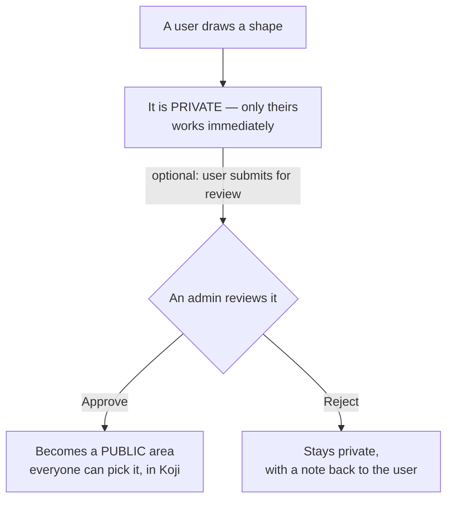
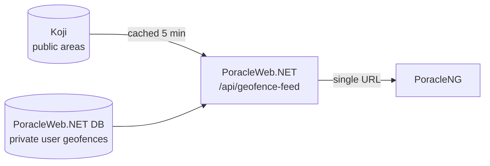

# Custom Geofences

This section is for **operators deploying and running PoracleWeb.NET.NET** — the person who configures the server, connects it to Koji, and approves user submissions. It explains how custom geofences work, how they connect to Koji, and how to set everything up so your users can draw their own notification zones.

You do not need to read the code to use this guide. Where something is a value you set, it is called out.

## The 30-second version

Your users can draw their own polygons on a map ("**custom geofences**") to get Pokémon GO notifications only inside those shapes. By default each drawn geofence is **private** — it works only for the user who drew it. If a user thinks their area is useful to everyone, they can submit it; an **admin** reviews it and can **promote** it into a public area that everyone can pick. Public areas live in **Koji**; private ones live inside PoracleWeb.NET.

## How PoracleNG gets its geofences (and why not straight from Koji)

Your bot does **not** read geofences from Koji. It reads them from **one PoracleWeb.NET URL** — `/api/geofence-feed` — which serves a single combined list: the public areas (from Koji) **plus** the private user-drawn areas (from PoracleWeb.NET's own database).

Why it's set up this way:

- **One source, not two.** The bot needs a single geofence source. PoracleWeb.NET does the Koji round-trip for you and merges in the private areas, so a stock PoracleNG install works with one config line — no custom code in the bot or in Koji.
- **Privacy.** Private user geofences must stay hidden from the bot's `!area` picker and from notification DMs. PoracleWeb.NET serves them with the right "hidden" flags. Pushing them into Koji wouldn't reliably hide them (Koji's hide-from-matches property isn't honored by every notification formatter), so PoracleWeb.NET keeps them in its own database and serves them itself.
- **Resilience.** If Koji is briefly unreachable, PoracleWeb.NET still serves the private user geofences and the last-known public ones, so notifications keep flowing. The bot also keeps its own local cache as a further safety net.

The full breakdown is in [Troubleshooting → How the combined feed works](troubleshooting.md#how-the-combined-feed-works-background).

## What's in this section

| Page | Read this if you want to… |
|---|---|
| [Key concepts](key-concepts.md) | Understand the difference between an **area**, a **geofence**, and a **region** (start here). |
| [Koji & regions](koji-and-regions.md) | Connect PoracleWeb.NET to Koji and **set up regions**. Includes the geofence ↔ region diagram. |
| [Private geofences & promotion](private-and-promotion.md) | Understand how a geofence stays **private**, and the step-by-step flow to **promote** one to a public area. |
| [Admin operations](admin-operations.md) | Review, approve, reject, and delete geofences from the admin screen. |
| [Troubleshooting](troubleshooting.md) | Fix common problems: empty region dropdown, geofences not showing up, Koji errors, deleting from Koji. |

## Three words to learn first

| Term | In one sentence |
|---|---|
| **Geofence** | A named shape (polygon) drawn on the map. |
| **Area** | A name on a user's "notify me here" list — turning a geofence on. |
| **Region** | A folder in Koji that groups public geofences together (e.g. a state or city). |

!!! tip "If you remember nothing else"
    A geofence is a **shape**, an area is a **subscription** to that shape, and a region is a **folder** for public shapes. The [Key concepts](key-concepts.md) page expands on this.
