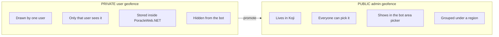
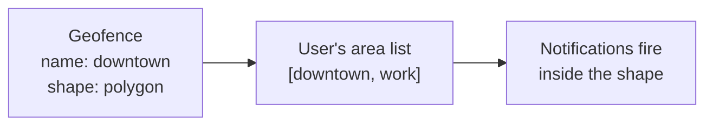

# Key Concepts — Areas, Geofences & Regions

Three words get used constantly and they are easy to mix up. This page pins them down in plain language. Everything else in this section builds on it.

## The mailing-list analogy

Think of notifications like a set of mailing lists:

- A **geofence** is a *shape on the map with a name*. It says **where** something happens — "anything inside this polygon."
- An **area** is **subscribing** to that shape. The shape does nothing until a user adds its name to their personal "notify me here" list. The area is the subscription; the geofence is the shape behind it.
- A **region** is a *folder* that groups public shapes together so they're easier to find — "all the geofences in Colorado." Regions live only in Koji and are set up by you, the operator.

## The three concepts side by side

| | **Geofence** | **Area** | **Region** |
|---|---|---|---|
| Plain meaning | A named shape on the map | A name on a user's "notify me" list | A folder that groups public shapes |
| Answers | *Where?* | *Am I subscribed?* | *Which group does it belong to?* |
| Who creates it | A user (draws it) or you (in Koji) | A user (toggles it on) | You, the operator (in Koji) |
| Where it's stored | Private: inside PoracleWeb.NET. Public: in Koji. | In the user's profile | In Koji |
| Example | A polygon named `downtown` | `downtown` is on your list | `Colorado` contains `downtown`, `boulder`, … |

## Two kinds of geofence

There are exactly two kinds, and the whole system is about the relationship between them:

A private geofence can **stay private forever** — most do. Promotion is optional and is covered in [Private geofences & promotion](private-and-promotion.md).

## The one rule that ties it together

!!! abstract "The rule"
    A geofence only sends notifications to a user when that geofence's **name is on that user's area list**.

Drawing a shape isn't enough on its own — the name has to be "switched on." When a user draws a geofence, PoracleWeb.NET switches it on for them automatically. They can later toggle it off (and back on) per profile without deleting it.

If the name is **not** on the list, the shape is dormant — it exists, but it's silent.

## Profiles: on for one, off for another

PoracleWeb.NET users can have multiple **profiles** (e.g. "Home", "Work"). A geofence is owned by the **user**, but the on/off switch is **per profile**. So the same `downtown` shape can be **on** for the Home profile and **off** for the Work profile. Drawing it once is enough; the user flips it per profile with a toggle.

## A note on capitalization (it matters)

PoracleJS/PoracleNG matches area names **exactly, including case**. PoracleWeb.NET stores every geofence name in **lowercase** to avoid surprises — `Downtown` and `downtown` are *not* the same to PoracleJS/PoracleNG, and a mismatch means no notifications, silently.

!!! warning "If you edit the database by hand"
    You don't normally need to do anything — PoracleWeb.NET handles lowercasing. But if you ever edit area names directly in `humans.area`, `profiles.area`, or a geofence name, keep them **lowercase**.
