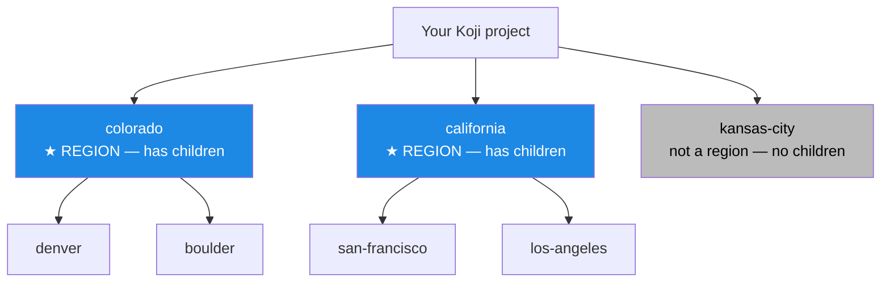
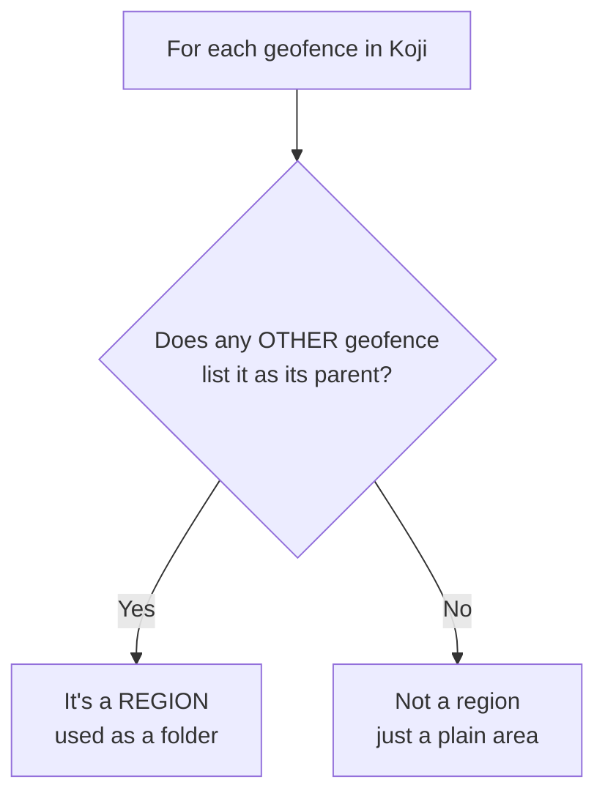
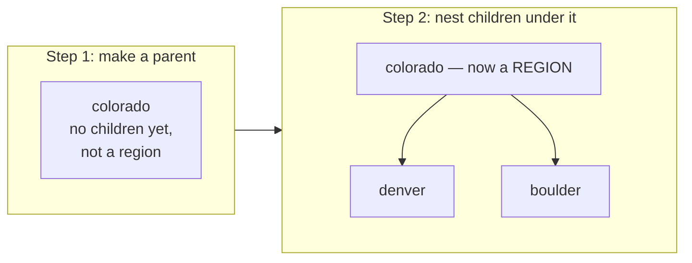

# Koji & Regions

This page covers two operator jobs: **connecting PoracleWeb.NET to Koji**, and **setting up regions** so the region picker works for your users. The region picker is the part most operators get tripped up on, so the relationship between geofences and regions is laid out carefully with diagrams.

## What Koji is doing here

[Koji](https://github.com/TurtIeSocks/Koji) is the home for your **public** geofences — the admin-managed areas everyone can subscribe to. PoracleWeb.NET talks to Koji to:

1. **Read** the list of public areas (so users can pick them, and the bot can match on them).
2. **Read** your regions (the folders that group public areas).
3. **Write** a new public area when an admin approves a user submission.

Private user geofences never touch Koji — they live inside PoracleWeb.NET until (and unless) an admin promotes them.

!!! info "PoracleNG never talks to Koji directly"
    PoracleWeb.NET is the only thing that talks to Koji. PoracleWeb.NET merges Koji's public areas with the private user areas and serves them as **one combined feed**. PoracleNG reads that single URL. See [Troubleshooting → How the combined feed works](troubleshooting.md#how-the-combined-feed-works-background).

## Connecting PoracleWeb.NET to Koji

Set these in your `.env` file:

| `.env` variable | What it is | Example |
|---|---|---|
| `KOJI_API_ADDRESS` | URL of your Koji server | `http://koji-host:8080` |
| `KOJI_BEARER_TOKEN` | Koji API token | `your-koji-token` |
| `KOJI_PROJECT_ID` | The numeric Koji **project** PoracleWeb.NET works in | `1` |
| `KOJI_PROJECT_NAME` | That project's name (used for the area feed) | `MyProject` |

!!! warning "The token is read at startup"
    `KOJI_BEARER_TOKEN` is read **once when PoracleWeb.NET starts**. If you change it, **restart PoracleWeb.NET** for it to take effect.

Then point your **PoracleNG** bot at PoracleWeb.NET's combined feed (a single URL, not Koji) via its geofence-source setting:

```jsonc
// PoracleNG bot — geofence source
"geofence": {
  "path": "http://poracleweb:8082/api/geofence-feed"
}
```

That's the whole connection. If Koji is briefly down, PoracleWeb.NET keeps serving the private user geofences and the last-known public ones, so notifications don't stop dead.

## How geofences and regions relate in Koji

This is the key mental model.

!!! abstract "A region is not a special object"
    Koji only has geofences. A geofence becomes a **region** simply by having **other geofences nested underneath it** (children that point to it as their *parent*).



So:

- **A region = a parent geofence** (a geofence that other geofences are nested under).
- **The region itself is hidden** from the area picker — you don't subscribe to `colorado`, you subscribe to `denver`, *which is grouped under* Colorado.
- A geofence with **no children is not a region** — it's just a plain selectable area (`kansas-city` above).

Here's how PoracleWeb.NET decides what counts as a region:



## Setting up regions (the operator how-to)

If your users open the "draw a geofence" dialog and the region dropdown is empty (or only shows "All"), it's because **your Koji project has no nesting** — every geofence is flat, with no parents. Here's how to create regions:

1. **Create a parent geofence in Koji** for each region you want — for example a polygon for the whole state of `colorado`, or a metro area like `denver-metro`. This is just a normal Koji geofence; nothing special.
2. **Nest your public area geofences under it.** In Koji, open each child geofence (e.g. `denver`, `boulder`) and set its **parent** to the region geofence (`colorado`). That parent link is the only thing that makes a region.
3. **Done.** Reload the geofence page in PoracleWeb.NET (the list refreshes within 5 minutes, or immediately after the next approval). Each parent that now has at least one child shows up as a region, using the parent geofence's display name as the folder label.



### Do you even need regions?

**No — regions are optional.** They are a convenience for *grouping* public areas and for *auto-suggesting* a folder when a user draws a shape. If your Koji project is flat and you don't want regions:

- Users can still draw private geofences and use them — the region picker simply hides itself when there are no regions (this fixes the empty-dropdown problem; see [Troubleshooting](troubleshooting.md#the-region-dropdown-is-empty-or-only-shows-all)).
- When an admin promotes a geofence, they can leave the region unset, and it becomes an ungrouped public area. You can always organize it into a region later in Koji.

## Koji geofence properties (and how they're used)

When PoracleWeb.NET promotes a geofence to a public area, it writes a set of **properties** onto the Koji geofence. If you create or edit geofences **directly in Koji**, these are the same properties that matter — and getting `userSelectable` / `displayInMatches` wrong is the usual cause of a private area leaking into the bot, or a public area never showing up.

There are two groups. The `__`-prefixed keys are **Koji structural directives** (they set Koji's own built-in fields). The rest are **custom properties** that Koji stores on the geofence and passes through to the bot feed.

### Structural directives (the `__` keys)

| Property | Value PoracleWeb.NET sends | What it does |
|---|---|---|
| `__name` | the lowercase area name | Koji's internal geofence key — this is the name that ends up in users' area lists and that the bot matches on. Must be **lowercase**. |
| `__mode` | `unset` | Koji's geofence "mode" marker. PoracleWeb.NET doesn't use modes, so it leaves this unset. |
| `__projects` | `[ <your KOJI_PROJECT_ID> ]` | Which Koji **project(s)** the geofence belongs to. A geofence must be in your project to appear in the feed. Sending an **empty** list (`[]`) removes it from the project — that's how "remove from project" works. |
| `__parent` | the region's geofence **id**, or `null` | Nests this geofence under a region (see [the region relationship](#how-geofences-and-regions-relate-in-koji)). Must be a real geofence id or `null` — never `0`. |

!!! danger "`__parent` must be `null`, not `0`, for no region"
    Koji looks up `__parent` as a real geofence id. Sending `0` makes Koji reject the save with `[GEOFENCE]: Does not exist` (while still writing the row — a half-broken state). PoracleWeb.NET sends `null` for a region-less geofence so this works cleanly. If you set parents by hand in Koji, leave it empty rather than `0`.

### Custom properties (passed through to the bot feed)

| Property | Value PoracleWeb.NET sends | What it does |
|---|---|---|
| `name` | the user-facing display name | The friendly label shown in PoracleWeb.NET's region/area lists. Read back from Koji to label regions. |
| `group` | the region/category label | The folder a public area is shown under in the bot's area picker. For admin geofences this is resolved from the parent chain. |
| `parent` | the same region/category label | A duplicate of `group` that some PoracleNG format serializers read instead of `group`. (This is the *custom* `parent` property — a text label — and is separate from the structural `__parent` id above.) |
| `userSelectable` | `true` when public, `false` when private | **The visibility switch.** `true` = the area appears in the bot's `!area` picker. `false` = hidden. PoracleNG also refuses to let a non-admin subscribe to a `userSelectable=false` area through its `setAreas` call, which is why private user geofences are managed entirely inside PoracleWeb.NET. |
| `displayInMatches` | `true` when public, `false` when private | Whether the **area name appears in notification DM text**. `false` keeps private geofence names out of messages. |

For a **private** user geofence, PoracleWeb.NET never writes any of this to Koji — it serves the geofence from its own feed with `userSelectable=false` and `displayInMatches=false`. For an **approved (public)** geofence, both flags are set to `true` and the geofence is written into Koji as a normal public area.

### What PoracleWeb.NET reads back from Koji

| Koji endpoint | Properties read | Used for |
|---|---|---|
| `/api/v1/geofence/reference` | `id`, `name` (internal), `parent` (numeric id) | Listing every geofence and deriving which ones are **regions** (a geofence referenced as another's parent). |
| `/api/v1/geofence/area/{name}?rt=feature` | `properties.name`, the polygon geometry | The region's **display name** and its outline (used for region auto-detection). |
| `/api/v1/geofence/poracle/{project}` | name, polygon path, group | The public-area list merged into the combined feed. |

## What auto-detection does

When a user draws a shape, PoracleWeb.NET tries to **guess the region** by checking which region's outline the drawn shape falls inside (using the center point of the drawing). If it finds a match, it pre-fills the region for the user. This is purely a convenience — the user can change or clear it, and it only works if your regions have outlines (which they do, since they're real Koji geofences).
