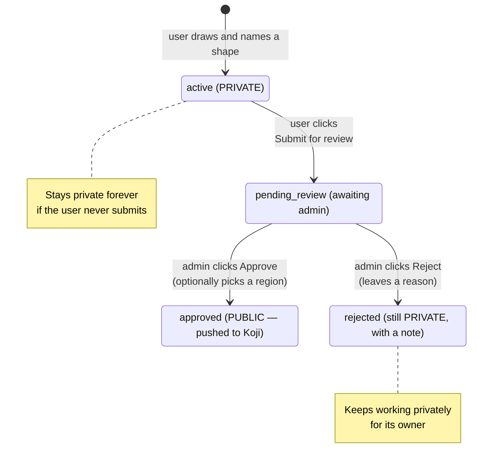
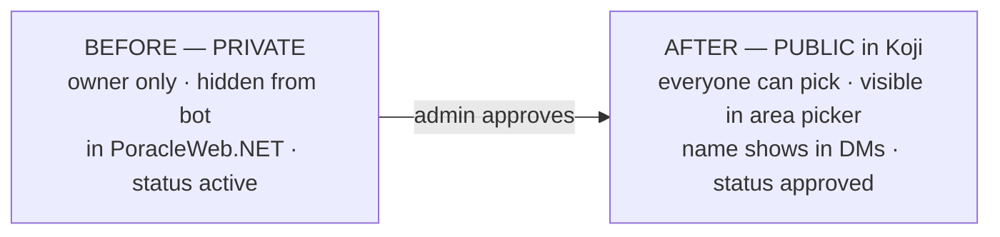

# Private Geofences & Promotion

This is the heart of the feature. A user-drawn geofence has two possible lives: it can **stay private forever**, or it can be **promoted** into a public area that everyone can use. This page explains both, with the full step-by-step flow.

## A geofence is private by default

When a user draws a shape and names it, it becomes a **private geofence** straight away:

- It works **immediately** — notifications start firing inside the shape for that user.
- **Only that user** can see or use it. Other users have no idea it exists.
- Its name is **hidden** from the PoracleJS/PoracleNG bot — it won't appear in the bot's `!area` picker, and the area name won't show in notification messages.
- It's stored **inside PoracleWeb.NET**, not in Koji.

## Staying private is a complete, valid choice

!!! success "Most geofences stay private — and that's fine"
    There is no requirement to submit or promote anything. A private geofence is fully functional on its own. A user can draw several personal areas (up to the per-user limit) and never involve an admin at all.

A user might keep a geofence private because:

- It's personal — their neighborhood, commute, or a specific park loop.
- It's only useful to them, so there's no reason to clutter everyone's public list.
- They simply don't want to share it.

Nothing expires and nothing nags them. Private is the default **and** the destination for the large majority of geofences.

## When promotion makes sense

Promotion turns a private geofence into a **public admin geofence** that *everyone* can subscribe to. It makes sense when a user-drawn area is genuinely useful to the whole community — a popular park, a downtown core, a well-known raid hotspot.

Promotion is a **two-party** action:

- The **user** asks for it ("submit for review").
- An **admin** decides ("approve" or "reject").

A user cannot promote their own geofence, and an admin doesn't promote things out of nowhere — it always starts with a user submission.

## The promotion flow, end to end

### Step 1 — User draws and (optionally) submits

The user draws the shape, names it, and it's private. If they want it public, they click **Submit for review**. The geofence moves to **pending_review** and (if you've configured a Discord forum — see [Admin operations](admin-operations.md#optional-discord-forum-integration)) a forum thread opens so your team can discuss it.

The geofence keeps working for the user the whole time it's under review — submitting doesn't take it away from them.

### Step 2 — Admin reviews

You (the admin) see the submission in the admin **Geofence Submissions** screen. You can look at the shape on a map, see who submitted it, and decide. See [Admin operations](admin-operations.md) for the screen details.

### Step 3a — Approve (the actual promotion)

When you click **Approve**:

- You can give it a cleaner public name if you want (the "promoted name").
- You can assign it to a **region** so it's filed in the right folder — or leave it unset if you don't use regions.
- PoracleWeb.NET **pushes the geofence into Koji** as a public area.

At that moment the geofence flips from private to public:

| | Before (private) | After (approved / public) |
|---|---|---|
| Lives in | PoracleWeb.NET | **Koji** |
| Who can use it | only the owner | **everyone** |
| In the bot's `!area` picker | hidden | **visible** |
| Name shown in notification DMs | hidden | **shown** |
| Region / grouping | none | the region you chose (if any) |
| Status | `active` | `approved` |

### Step 3b — Reject (stays private)

If the area isn't a good fit for everyone, you click **Reject** and leave a short reason. The geofence:

- Moves to **rejected** status,
- **Stays private** and keeps working for its owner,
- Carries your note so the user understands why.

!!! note "Rejection is not deletion"
    The user loses nothing except the public listing they asked for. The geofence keeps working for them privately.

## Quick reference: the four statuses

| Status | What it means | Public? |
|---|---|---|
| `active` | Normal private geofence (the default after drawing). | No |
| `pending_review` | The user has submitted it; waiting on an admin. | No (still private to the owner) |
| `approved` | An admin promoted it; it's now a public Koji area. | **Yes** |
| `rejected` | An admin declined the request; it stays private with a note. | No |

## Removing a public area later

If you later decide a promoted geofence shouldn't be public, an admin can delete it from the admin screen — PoracleWeb.NET removes it from the project so it stops being a selectable public area. (Fully scrubbing a geofence out of Koji's database is done in the Koji UI; see [Troubleshooting](troubleshooting.md#removing-a-geofence-from-koji-completely).)
