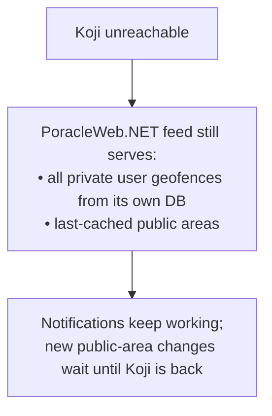
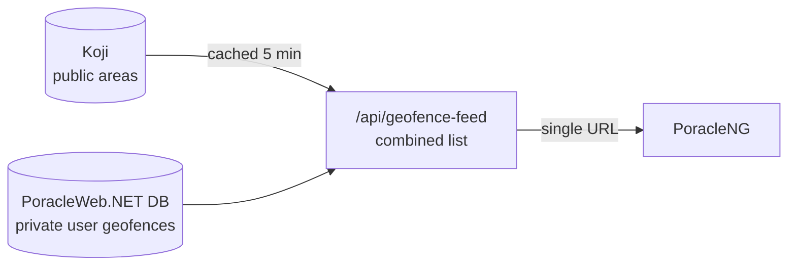

# Troubleshooting

Common problems operators hit, what causes them, and how to fix them. Each entry is symptom → cause → fix.

## The region dropdown is empty (or only shows "All")

**Symptom:** when a user draws a geofence, the region picker has nothing useful in it, and (in older builds) the Save button stays greyed out.

**Cause:** your Koji project is **flat** — no geofence is nested under another, so there are no regions to show. Regions are derived purely from parent/child nesting in Koji (see [Koji & regions](koji-and-regions.md#how-geofences-and-regions-relate-in-koji)).

**Fix — pick one:**

- **You want regions:** create parent geofences in Koji and nest your public areas under them. Step-by-step in [Setting up regions](koji-and-regions.md#setting-up-regions-the-operator-how-to).
- **You don't want regions:** nothing to do. Current builds make the region **optional** — the picker hides itself when there are no regions, and users can save a geofence without one.

## A user's private geofence isn't sending notifications

Work down this list:

1. **Is it switched on for the right profile?** A geofence is on/off **per profile**. If the user switched profiles, it may be off on the new one. Have them check the toggle on the Geofences page for the active profile.
2. **Is PoracleNG pointed at PoracleWeb.NET's feed?** The bot's geofence-source setting must be the combined feed URL (`http://poracleweb:8082/api/geofence-feed`), **not** Koji. If it points at Koji, private geofences will be missing entirely.
3. **Did PoracleNG reload its geofences?** PoracleWeb.NET tells PoracleNG to reload after changes, but if the bot was down at that moment, trigger a reload (or it'll pick it up on its next refresh).
4. **Polygon too small or odd?** A shape needs at least 3 points and must be a real area. Degenerate shapes are dropped from the feed.

## Public (approved) geofences aren't showing up

1. **Wait up to 5 minutes.** PoracleWeb.NET caches the Koji public list for 5 minutes. An approval clears that cache immediately, but a change made **directly in the Koji UI** won't be picked up until the cache expires.
2. **Check the Koji connection.** Wrong `KOJI_API_ADDRESS`, a bad `KOJI_BEARER_TOKEN`, or the wrong `KOJI_PROJECT_NAME` means PoracleWeb.NET can't read the public list. Remember the token is read **at startup** — restart after changing it.
3. **Is it actually in the project?** A geofence must belong to your `KOJI_PROJECT_ID` to appear. Parent/region geofences are intentionally excluded (they're folders, not selectable areas).

## Koji is down — what happens?

PoracleWeb.NET **degrades gracefully** rather than failing:

PoracleNG also keeps its own local cache as a second safety net.

!!! warning "You can't approve while Koji is down"
    Approving a submission writes to Koji, so approvals will error until Koji is reachable again. Everything else keeps working.

## Approval fails with a Koji error

The usual causes are an unreachable Koji or an auth problem (token/project). One specific gotcha worth knowing:

!!! info "The `__parent: 0` gotcha"
    Koji treats a geofence's parent as a real geofence ID. Sending a parent of `0` makes Koji reject the save with `[GEOFENCE]: Does not exist`. PoracleWeb.NET handles this for you — a geofence with **no** region is sent with a true "no parent" value, not `0` — so region-less approvals work. If you see this exact error from a custom integration, that's the cause.

## A geofence name shows in the bot when it shouldn't (or vice-versa)

Two flags control visibility, and PoracleWeb.NET sets them for you:

| | Private user geofence | Public (approved) geofence |
|---|---|---|
| Appears in the bot's `!area` picker | No | Yes |
| Name shown in notification DMs | No | Yes |

If a **private** geofence's name is leaking into the bot picker or DMs, something is serving it as public — check that PoracleNG reads PoracleWeb.NET's feed (not Koji directly), and that the geofence wasn't accidentally promoted.

## Capitalization / name-match issues

PoracleNG matches area names **case-sensitively**. PoracleWeb.NET always stores names in **lowercase**, so this normally just works. If you've hand-edited `humans.area`, `profiles.area`, or a geofence name in the database, make sure everything is lowercase — a single capital letter means a silent mismatch and no notifications.

## Removing a geofence from Koji completely

Deleting an approved geofence in PoracleWeb.NET removes it from the **project** (so it's no longer selectable), but the geofence row can still exist in Koji's database. To delete it **completely**, do it in the **Koji UI**. (PoracleWeb.NET intentionally does not hard-delete Koji geofences via the API.) This also applies to any stray test geofences — clean them up in the Koji UI.

## How the combined feed works (background)

So you understand why the bot only needs one URL: PoracleWeb.NET exposes **`/api/geofence-feed`**, which merges two sources into one list for PoracleNG.

- **Public** entries come from Koji, marked visible/selectable.
- **Private** entries come from PoracleWeb.NET's database, marked hidden/non-selectable (so the bot ignores them in pickers and DMs).
- Region/parent geofences are filtered out (they're folders, not areas).

!!! warning "Keep the feed on a private network"
    The feed endpoint is open (no login) so PoracleNG can read it on your internal network. Don't expose it to the internet.
