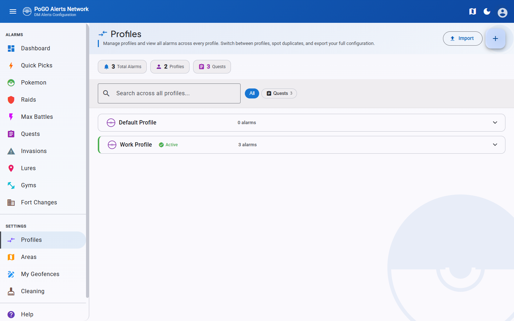

# Profile Management

Profiles let users maintain separate alarm configurations for different situations -- home, work, events, Pokemon GO Community Days, and more. Each profile has its own alarms, areas, location, and geofence activations, so switching between setups is instant.

## Cross-Profile Overview

The Profiles page provides a consolidated view of all profiles and their alarms in one place.

- **Stats bar** at the top shows total alarm counts per type (Pokemon, Raids, Quests, etc.) across all profiles
- **Search bar** filters alarms across all profiles by name, Pokemon, or other alarm attributes
- **Type filter chips** (Pokemon, Raids, Quests, Invasions, Lures, Nests, Gyms) narrow the view to specific alarm types
- **Expandable panels** for each profile display grouped alarms with game asset images for quick identification
- **Duplicate detection** -- alarms that exist on multiple profiles are highlighted with an orange border, making it easy to spot redundant filters

!!! tip
    Use the search bar and type filters together to quickly find a specific alarm across all your profiles. For example, search for "Gible" with the Pokemon filter chip active to see which profiles are tracking it.

## Creating & Switching Profiles

- Tap the **+** button to create a new profile with a unique name (up to 32 characters)
- **Switch** makes a profile the active one, indicated by a green badge
- **Edit** to rename an existing profile
- **Delete** to remove a profile (the currently active profile cannot be deleted)

Each profile maintains its own independent:

- Alarm filters (Pokemon, Raids, Quests, Invasions, Lures, Nests, Gyms, Fort Changes, Max Battles)
- Area selections
- Saved location
- Custom geofence activations

!!! warning
    Switching profiles changes which alarms are active immediately. Make sure you are on the correct profile before modifying alarms or areas.

## Profile Duplication

The **copy icon** on any profile creates an exact duplicate with all alarm filters.

- You are prompted for a new name (default: "Profile (Copy)")
- All alarm filters from the source profile are copied to the new profile
- Area selections are **not** copied -- the new profile starts with a fresh area configuration

!!! note
    After duplicating a profile, remember to configure areas for the new profile. Alarms will not trigger until at least one area is selected.

## Profile Export & Import

### Export

The **download icon** saves a JSON backup file containing all alarms from that profile. Internal IDs are stripped from the export to ensure portability across different PoracleWeb installations.

### Import

1. Tap the **upload button** on the Profiles page
2. Select a previously exported JSON backup file
3. Choose a name for the new profile
4. If the chosen name conflicts with an existing profile, a numeric suffix is added automatically
5. All alarm filters from the backup are restored into the new profile

!!! tip
    Export your profiles before making major changes. The backup file can be used to restore your configuration if something goes wrong, or to share alarm setups with other users.

## Weather Per Profile

The dashboard shows current weather conditions at your saved location. Since each profile can have a **different saved location**, weather information varies by profile.

For example, a "Home" profile with a residential location and a "Work" profile with an office location will each display the weather relevant to their respective area, helping you understand which weather-boosted Pokemon to expect at each location.
