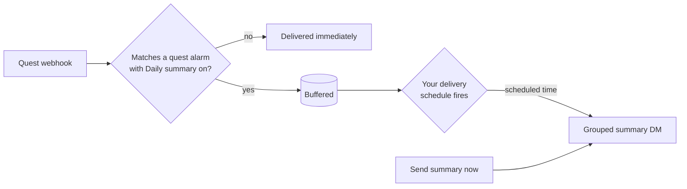

# Quest Summary Delivery

Field Research quests rotate daily and can match in large numbers, so a busy quest filter
can flood your Discord DMs. **Quest summary delivery** collects matching quests into a single
digest and delivers it on a schedule you choose -- one tidy message per day instead of dozens
of individual alerts.

The feature has two parts that work together:

1. A per-alarm **Daily summary** toggle that marks which quest alarms should be *buffered*
   instead of delivered immediately.
2. A per-user **delivery schedule** that decides *when* the buffered quests are sent.

Both are required: the toggle says *which* quests to collect, and the schedule says *when* to
deliver them.

!!! info "Requires PoracleNG support"
    Quest summary delivery is provided by PoracleNG (the bot). The web UI only appears when the
    connected PoracleNG instance has the feature enabled. If you do not see the **Quest summary
    delivery** menu on the Quests page, see [For server operators](#for-server-operators) below.

## How it works



When a quest matches an alarm that has **Daily summary** turned on, PoracleNG holds the match in
a per-user buffer instead of sending it right away. The buffer is flushed -- rendered into one
grouped message and delivered -- when your delivery schedule fires, or when you press **Send
summary now**. Quest alarms *without* the toggle continue to deliver individually as usual.

!!! note "The schedule is per-user, not per-profile"
    Unlike [profile active hours](profiles.md#active-hours), which are configured per profile, a
    quest summary schedule belongs to **you** and is shared across all of your profiles. You have
    at most one quest summary schedule.

## Step 1 -- Turn on Daily summary for a quest alarm

Open a quest alarm's **add** or **edit** dialog and enable **Daily summary**. This marks the alarm
so its matches are buffered for the digest rather than sent one-by-one. The setting is remembered
even if you originally set it from the bot -- editing the alarm in the web UI will not clear it.

!!! tip
    Turn the toggle on only for the quest alarms you want grouped. You can mix and match: keep
    high-priority quests (for example, a rare encounter reward) delivering immediately, and batch
    the noisier reward types into the daily summary.

## Step 2 -- Set your delivery schedule

Open the **Quests** page, then the **⋮** (more) menu in the toolbar, and choose **Quest summary
delivery**. The dialog shows your current schedule and lets you edit, clear, or trigger it.

### Editing the schedule

Choose **Edit schedule** to open the schedule editor -- the same editor used for
[profile active hours](profiles.md#using-the-schedule-editor):

1. **Select days** with the circular day buttons (**M T W T F S S**). Quick presets are available:
    - **Weekdays** -- Monday through Friday
    - **Weekends** -- Saturday and Sunday
    - **Every day** -- all seven days
2. **Choose a time** with the hour and minute dropdowns.
3. Choose **Add** to create entries for all selected days at that time.
4. Repeat to add more delivery times, then **Save**.

Saved delivery times appear as **amber pills** in the dialog (for example, "Mon-Fri 8:00 AM"),
grouped by day pattern. A short note beneath them explains what **Send summary now** does.

!!! warning "Timezone is determined by your location"
    PoracleNG decides when the schedule fires using your saved coordinates. If your active
    profile has **0,0 coordinates** (no location set), PoracleNG falls back to **UTC** and the
    summary will arrive at the wrong local time. A red warning appears in the dialog when a
    schedule is set but no pin is saved -- set your pin on the **Dashboard** or the
    **Areas & Places** page to fix it.

### Validation rules

The schedule uses the same structure and limits as profile active hours:

| Rule | Constraint |
|---|---|
| Day | Must be 1-7 (Monday through Sunday) |
| Hour | Must be 0-23 |
| Minute | Must be 0-59 |
| Maximum entries | 28 (up to 4 delivery times per day across all 7 days) |

## Send summary now

The **Send summary now** button flushes and delivers whatever is currently buffered, immediately
-- handy for testing or for getting the digest early. It is the equivalent of the bot's
`!summary quest now` command.

!!! note "Nothing buffered means nothing to send"
    Send summary now only delivers quests that have already been **buffered** since your last
    summary. If no matching quests have come in yet -- or you have just enabled the feature -- the
    buffer is empty and nothing is sent. This is expected; quests are buffered as they match, so
    give it time and try again, or wait for the schedule to fire.

To prevent accidental double-delivery, the button has a short cooldown after each use.

## Clearing the schedule

Choose **Remove schedule** in the dialog to delete your delivery schedule. Quest alarms with
**Daily summary** still buffer, but without a schedule they fall back to PoracleNG's default
delivery timing. Removing the schedule does not change the per-alarm toggle.

## When quest alarms are switched off

An operator can disable quests, either on this site or in Poracle's own config. A summary schedule
delivers nothing once that happens, so the dialog keeps only what is still useful: you can open it,
read the schedule you already have, and clear it. **Save** and **Send now** are gone, along with the
hint that described them.

Clearing stays available deliberately. A schedule that can never fire is worth removing, and when
quests are disabled in Poracle its bot refuses the matching command too, which would leave nowhere
else to do it. The same rule applies to the alarm types themselves — see
[Site Settings](../configuration/site-settings.md).

## For server operators

Quest summary delivery is gated by PoracleNG, not by PoracleWeb.NET. The web UI is hidden unless
the connected bot reports the feature as enabled.

To enable it, set the following in your PoracleNG `config.toml` and restart the processor:

```toml
[tracking]
quest_summary_enabled = true
# Optional: how long a buffered quest survives if the schedule never fires (default 24).
quest_summary_buffer_ttl_hours = 24
```

!!! info "How PoracleWeb.NET detects the flag"
    PoracleWeb.NET reads the effective value of `tracking.quest_summary_enabled` from PoracleNG's
    `/api/config/values` endpoint (cached for five minutes) and exposes it to the SPA. When the
    flag is on, the **Quest summary delivery** menu appears; when it is off or cannot be read, the
    menu is hidden so users are not led into a feature that will not deliver.

!!! warning "The processor API must be reachable"
    PoracleWeb.NET talks to PoracleNG over its HTTP API. Make sure the processor binds an address
    reachable from the PoracleWeb.NET host -- set `host = "0.0.0.0"` (or the LAN IP) under
    `[processor]`, not the `127.0.0.1` default, when the two run on different machines or in
    separate containers.

## Troubleshooting

See the dedicated entries in [Troubleshooting](../troubleshooting.md):

- [Quest summary delivery menu is missing](../troubleshooting.md#quest-summary-delivery-menu-is-missing)
- [Send summary now delivers nothing](../troubleshooting.md#send-summary-now-delivers-nothing)
