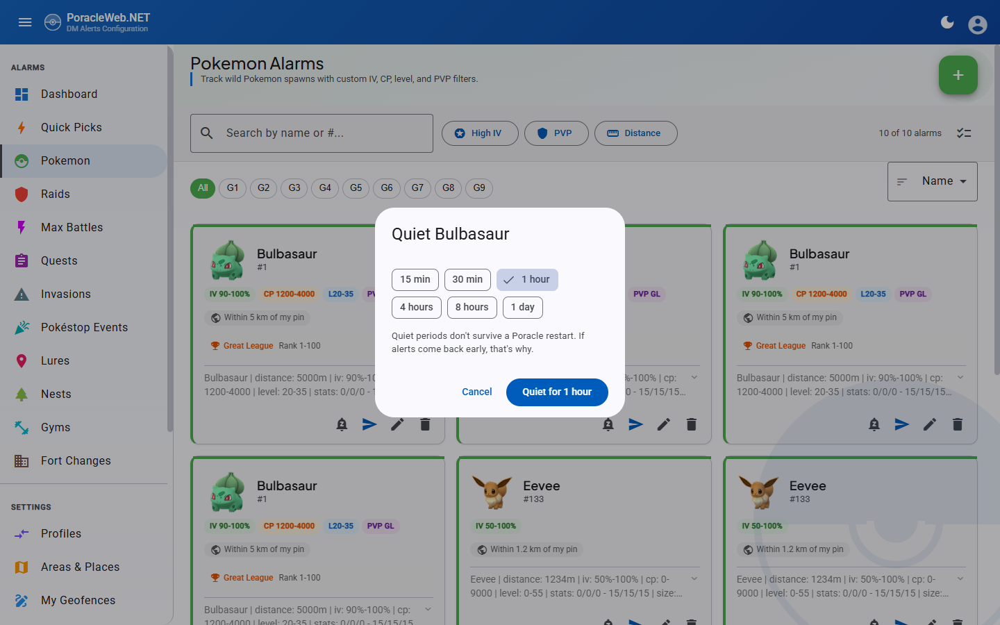

# Quiet Periods

A **quiet period** silences one subject for a while: this gym, this area, this species, this Power
Spot station. Alerts for everything else carry on. When the time runs out the subject comes back on
its own, with nothing to remember to switch on again.

The control lives wherever the subject is already named — a bell-with-a-slash button in an alarm
card's actions row, or a chip on a row of the Areas page. Press it, pick a duration, and the button
becomes a live countdown.

## Quiet periods are not Pause Alerts

The two are easy to confuse and behave nothing alike.

| | Quiet period | Pause Alerts (user menu) |
|---|---|---|
| Covers | One gym, area, species or station | Your whole account |
| Ends | At the time you chose | When you turn it back on |
| Survives a Poracle restart | No | Yes |
| Visible while it is on | The countdown on that subject's chip | A red banner across every page |

Pause Alerts toggles your Poracle account's `enabled` flag. A quiet period leaves the account
enabled and suppresses one subject's matches inside the bot.

## What you can quiet

Four scopes are offered:

| Scope | Where the chip is | What it silences |
|---|---|---|
| **Gym** | Gym cards, and raid and egg cards that target a specific gym | Everything at that gym |
| **Species** | Pokemon cards and nest cards | That Pokemon, from any rule |
| **Area** | Both halves of the Areas page — the selected-area chips and the area list rows | Everything inside that area |
| **Station** | Max Battle cards that target a specific station | Everything at that Power Spot |

A chip only appears where there is an identifier to quiet. A gym alarm set to "any gym" has no gym
id, so it gets no chip; the same for a Max Battle rule with no station. Quests, invasions, lures and
fort changes carry no such identifier at all — a quest is defined by its reward, an invasion by its
grunt type — so those pages have no chip anywhere.

### Three scopes the site does not create

PoracleNG's mute store holds three more scopes. All three are listed and can be lifted here, because
a mute set from the Discord bot has to be visible somewhere; none of them can be created here.

**Rule** (`tracking`) quiets one alarm by its uid. Alarm uids are per-table auto-increments with
overlapping ranges — on live data, gym uids 31 to 121 sit entirely inside the raid range — and
upstream's matcher compares the number without asking which table it came from. Quieting "gym rule
121" would also quiet raid rule 121. That is an upstream defect rather than something a client can
work around, so the site declines to offer it.

**Pokestop** quiets one stop. Nothing in PoracleWeb.NET names a stop: neither the lure model nor the
invasion model carries a fort id.

**Everything** quiets the account. That is what Pause Alerts already does.

## Durations

Six choices: 15 minutes, 30 minutes, 1 hour, 4 hours, 8 hours and 1 day. PoracleNG's own default is
60 minutes and its ceiling is one week.

Pressing an already-quiet chip re-opens the same sheet, where a duration **extends** rather than
stacks — picking 4 hours on a subject with 20 minutes left leaves it quiet for 4 hours from now, not
4 hours and 20 minutes. The same sheet lifts the quiet period early.

## Two things to know before relying on one

!!! warning "A Poracle restart clears every quiet period"
    The store lives in the processor's memory. It is not written to a database, and nothing warns you
    when it goes. If alerts for something come back sooner than you expected, a restart is the reason.
    This is why the chip shows a countdown rather than a clock time: "quiet until 4:30" would be a
    promise the store cannot keep.

!!! note "Quiet periods belong to you, not to a profile"
    Switching profile does not lift them. A gym you quieted while on your Home profile is still quiet
    on your Work profile.

## The dashboard card

While anything is quiet, a **Quiet** card appears on the dashboard reading something like "3 quiet,
next back in 47m". It is absent the rest of the time rather than sitting there empty.

Opening it lists every active quiet period, including the three scopes only the bot can create, each
with a **Resume** button, plus **Resume everything**. This is the place to look when alerts have gone
missing and no chip you can find explains it.

## Requirements

!!! warning "Needs PoracleNG 5.2.0"
    The mute endpoints arrive in PoracleNG 5.2.0. Below that, every chip and the dashboard card render
    nothing at all — a control that fails on every press is worse than no control. PoracleWeb.NET
    decides this from the version PoracleNG reports, and an unreachable or unparseable server counts as
    "no", so the feature is hidden rather than half-working.

There is **no site setting that turns quiet periods off.** Nothing on **Admin → Settings** governs
them; availability is entirely a question of which PoracleNG is running.

## Impersonation

An admin viewing another account, or a delegate managing a webhook, can **read** quiet periods but
cannot set or lift one. The write endpoints answer 403.

Reads stay open on purpose: "why is this person getting nothing" is exactly the question an admin
opens an impersonation session to answer, and a quiet period is one of the answers. Writes are refused
because the session acts as the account being viewed, so an accidental press would silence somebody
else's alerts.

## API

| Endpoint | Purpose |
|---|---|
| `GET /api/mutes` | `{ capable, mutes }` — whether this server supports the feature, and the caller's active quiet periods |
| `POST /api/mutes` | Quiets a subject, or extends an existing quiet period on the same subject |
| `DELETE /api/mutes?scope=&value=` | Lifts one; with no scope, lifts all |

Rate limited to 60 requests per 60 seconds. Creates accept the four writable scopes; deletes accept
all seven, so a bot-set mute is liftable.

PoracleNG canonicalises the value it stores — an area submitted as `aberdeen` comes back as
`Aberdeen` — and matches a delete string exactly, so a delete has to send back the value the list
returned rather than the one that was submitted.

## Related

- [Alarm Management](alarms.md) — the cards the chip sits on
- [PoracleNG Version Compatibility](../architecture/poracleng-compatibility.md) — how version support is decided
